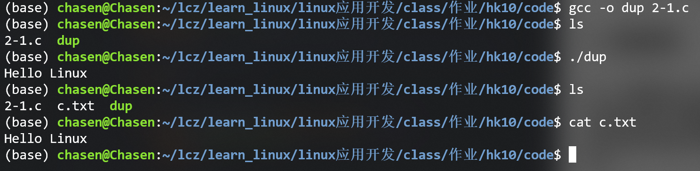
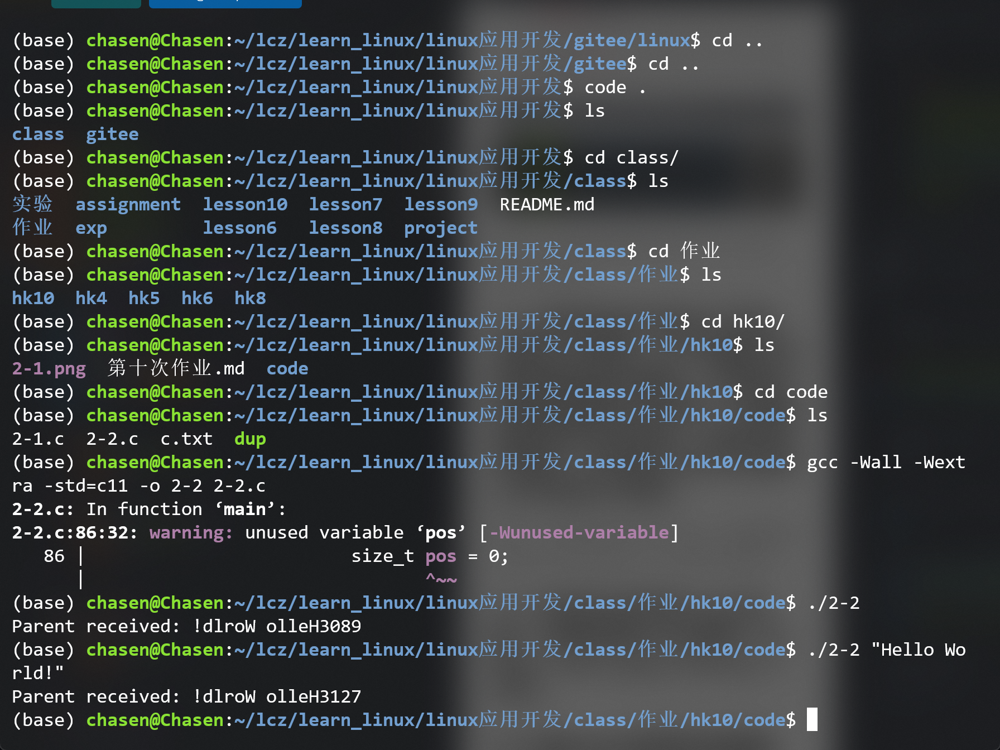
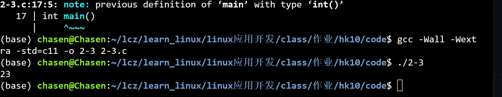
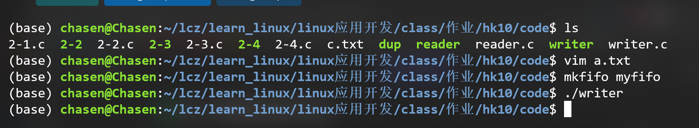
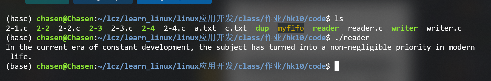

## 1. 问答题

### 1.1. 操作系统中进程通信的作用？

- 数据交换：在进程间传递信息或数据（例如父子进程交换计算结果或命令）。
- 同步与协调：通过通信机制实现进程间的同步（比如等待/通知、互斥），避免竞态条件。
- 资源共享：多个进程协同访问或共享资源（如共享内存、文件映射），提高效率。
- 分布式/模块化设计支持：把功能拆成多个进程（或服务），通过 IPC 协作完成复杂任务，便于隔离与安全控制。
- 提高可靠性与可扩展性：进程隔离错误域，单个进程崩溃不必影响全部，通过通信重启或替换组件。

### 1.2. Linux进程间通信有哪几种方式？这几种方式之间的特点是什么？

- 无名管道（pipe）：
  - 特点：半双工（单向）、只能用于具有亲缘关系的进程（父子或已创建的子进程之间）。
  - 适用：简单的父子通信、单向数据流传输。
- 有名管道（FIFO）：
  - 特点：存在于文件系统，可以在任意进程间通信（只要知道路径）、仍为字节流。
  - 适用：不同进程、不同会话之间的简单通信与脚本交互。

### 1.3. 查看以下代码：

```c
int fd1, fd2, fd3, fd4;
fd1 = open("a.txt", O_RDONLY);
fd2 = open("b.txt", O_WRONLY);
fd3 = dup(fd1);
fd4 = dup2(fd2, 0);
```

假设当前终端没有打开任何正常文件，请问：最后fd1、fd2、fd3和fd4的值为多少？并解释原因。

因为没有正常打开文件，open会返回一个最小的文件描述符，第一次fd1就被分配了最小的0，fd2因为0已经被分配，所以当前最小的就是1，以此类推。
最终结果如表：

| 变量      | 值     | 原因                               |
| ------- | ----- | -------------------------------- |
| **fd1** | **0** | 打开第一个文件得到最小 fd                   |
| **fd2** | **1** | 下一个最小可用 fd                       |
| **fd3** | **2** | dup(0) 返回最小未占用 fd                |
| **fd4** | **0** | dup2(1,0) 强制把 fd0 重定向到 fd2 指向的文件 |


提示：
- 系统调用dup()和dup2()都能够复制文件描述符。
- dup返回新的文件描述符，成功时返回最小的尚未被使用的文件描述符。
- dup2可以让用户指定返回的文件描述符的值，它通常用来重新打开或者重定向一个文件描述符。


## 2. 编程题

### 2.1. 利用dup/dup2实现往文件中写入数据。要求：在代码中执行两次以下语句：

`printf(“Hello Linux\n”);`

前一次输出到文件c.txt中，后一次输出到屏幕上。

```c
// 2-1.c dup/dup2 向文件中写入数据
#include <stdio.h>
#include <unistd.h>
#include <fcntl.h>

int main() {
    int fd, saved_stdout;

    // 1. 打开文件 c.txt，用于写入（不存在则创建）
    fd = open("c.txt", O_WRONLY | O_CREAT | O_TRUNC, 0664);
    if (fd < 0) {
        perror("open");
        return 1;
    }

    // 2. 保存当前的标准输出文件描述符（屏幕）
    saved_stdout = dup(STDOUT_FILENO);
    if (saved_stdout < 0) {
        perror("dup");
        return 1;
    }

    // 3. 用 dup2 将文件描述符 fd 覆盖到标准输出 stdout
    if (dup2(fd, STDOUT_FILENO) < 0) {
        perror("dup2");
        return 1;
    }

    // 4. 此时 printf 输出会写入 c.txt
    printf("Hello Linux\n");
    fflush(NULL);    // 刷新所有标准 IO 缓冲

    // 5. 关闭文件 c.txt
    close(fd);

    // 6. 恢复标准输出到屏幕
    if (dup2(saved_stdout, STDOUT_FILENO) < 0) {
        perror("dup2 restore");
        return 1;
    }

    close(saved_stdout);

    // 7. 再次打印，此时输出到屏幕
    printf("Hello Linux\n");
    fflush(NULL);

    return 0;
}
```



提示：printf语句后增加fflush(NULL);语句，刷新打开的流。

### 2.2. 编写程序实现如下功能：创建父子进程，父子进程之间通过管道进行通信，父程向子进程发送英文字符串，子进程接收到该字符串后，将该字符串倒序，并附加上自己的进程pid传回给父进程。

例如：父进程发出Hello World!；子进程处理返回!dlroW olleH2709，2709是子进程号。



```c
/*
### 2.2. 编写程序实现如下功能：创建父子进程，父子进程之间通过管道进行通信，父程向子进程发送英文字符串，子进程接收到该字符串后，将该字符串倒序，并附加上自己的进程pid传回给父进程。

例如：父进程发出Hello World!；子进程处理返回!dlroW olleH2709，2709是子进程号。
*/

#include <stdio.h>
#include <stdlib.h>
#include <string.h>
#include <unistd.h>
#include <sys/types.h>
#include <sys/wait.h>
#define MAXLINE 1024
int main(int argc, char *argv[])
{
	int p2c[2]; /* parent -> child */
	int c2p[2]; /* child -> parent */
	pid_t pid;
	char sendbuf[MAXLINE];
	char recvbuf[MAXLINE + 64];
	ssize_t n;

	if (pipe(p2c) == -1) {
		perror("pipe p2c");
		return 1;
	}
	if (pipe(c2p) == -1) {
		perror("pipe c2p");
		return 1;
	}

	pid = fork();
	if (pid < 0) {
		perror("fork");
		return 1;
	}

	if (pid == 0) {
		/* Child */
		close(p2c[1]); /* close write end of parent->child */
		close(c2p[0]); /* close read end of child->parent */

		/* read message from parent */
		n = read(p2c[0], sendbuf, sizeof(sendbuf)-1);
		if (n < 0) {
			perror("child read");
			_exit(1);
		}
		if (n == 0) {
			/* no data */
			close(p2c[0]);
			close(c2p[1]);
			_exit(0);
		}
		sendbuf[n] = '\0';

		/* reverse the string in-place */
		size_t len = strlen(sendbuf);
		for (size_t i = 0; i < len/2; ++i) {
			char t = sendbuf[i];
			sendbuf[i] = sendbuf[len-1-i];
			sendbuf[len-1-i] = t;
		}

		/* append child pid */
		snprintf(recvbuf, sizeof(recvbuf), "%s%ld", sendbuf, (long)getpid());

		/* write back to parent */
		size_t to_write = strlen(recvbuf);
		ssize_t written = write(c2p[1], recvbuf, to_write);
		if (written < 0) {
			perror("child write");
			_exit(1);
		}

		close(p2c[0]);
		close(c2p[1]);
		_exit(0);
	} else {
		/* Parent */
		close(p2c[0]); /* close read end of parent->child */
		close(c2p[1]); /* close write end of child->parent */

		if (argc > 1) {
			/* join argv[1..] as message */
			size_t pos = 0;
			sendbuf[0] = '\0';
			for (int i = 1; i < argc; ++i) {
				if (i > 1) {
					strncat(sendbuf, " ", sizeof(sendbuf)-strlen(sendbuf)-1);
				}
				strncat(sendbuf, argv[i], sizeof(sendbuf)-strlen(sendbuf)-1);
			}
		} else {
			strncpy(sendbuf, "Hello World!", sizeof(sendbuf)-1);
			sendbuf[sizeof(sendbuf)-1] = '\0';
		}

		/* write to child */
		size_t len = strlen(sendbuf);
		if (write(p2c[1], sendbuf, len) != (ssize_t)len) {
			perror("parent write");
			close(p2c[1]);
			close(c2p[0]);
			wait(NULL);
			return 1;
		}
		close(p2c[1]);

		n = read(c2p[0], recvbuf, sizeof(recvbuf)-1);
		if (n < 0) {
			perror("parent read");
			close(c2p[0]);
			wait(NULL);
			return 1;
		}
		recvbuf[n] = '\0';

		printf("Parent received: %s\n", recvbuf);

		close(c2p[0]);
		wait(NULL);
	}

	return 0;
}

```

### 2.3. 利用无名管道pipe()函数、创建进程fork()函数，实现ps -uax | grep root |wc -l命令。



```c
/*
### 2.3. 利用无名管道pipe()函数、创建进程fork()函数，实现 ps aux | grep root | wc -l 命令。
   实现说明：
   - 使用两个无名管道，创建三个子进程或三个进程链路：
	   1) 执行 `ps aux`，其 stdout 重定向到 pipe1 的写端
	   2) 执行 `grep root`，其 stdin 来自 pipe1 的读端，stdout 重定向到 pipe2 的写端
	   3) 执行 `wc -l`，其 stdin 来自 pipe2 的读端
   - 父进程负责创建管道、fork 子进程并在最后等待子进程结束
*/

#include <stdio.h>
#include <stdlib.h>
#include <unistd.h>
#include <sys/types.h>
#include <sys/wait.h>

int main()
{
	int pipe1[2]; /* ps -> grep */
	int pipe2[2]; /* grep -> wc */
	pid_t pid1, pid2, pid3;

	if (pipe(pipe1) == -1) {
		perror("pipe1");
		return 1;
	}

	/* 第一个子进程：执行 ps aux，输出到 pipe1 写端 */
	pid1 = fork();
	if (pid1 < 0) {
		perror("fork pid1");
		return 1;
	}

	if (pid1 == 0) {
		/* child 1: ps aux */
		/* 将 stdout 重定向到 pipe1[1] */
		if (dup2(pipe1[1], STDOUT_FILENO) == -1) {
			perror("dup2 ps");
			_exit(1);
		}
		close(pipe1[0]);
		close(pipe1[1]);
		/* exec ps aux */
		execlp("ps", "ps", "aux", (char *)NULL);
		perror("execlp ps");
		_exit(1);
	}

	/* 父继续，关闭 pipe1 的写端（父不再写）
	   注意不要关闭 pipe1[0]，因为需要给下一个子进程作为 stdin */
	close(pipe1[1]);

	if (pipe(pipe2) == -1) {
		perror("pipe2");
		return 1;
	}

	/* 第二个子进程：执行 grep root，stdin 来自 pipe1[0]，stdout 到 pipe2[1] */
	pid2 = fork();
	if (pid2 < 0) {
		perror("fork pid2");
		return 1;
	}

	if (pid2 == 0) {
		/* child 2: grep root */
		if (dup2(pipe1[0], STDIN_FILENO) == -1) {
			perror("dup2 grep stdin");
			_exit(1);
		}
		if (dup2(pipe2[1], STDOUT_FILENO) == -1) {
			perror("dup2 grep stdout");
			_exit(1);
		}
		/* 关闭父中打开的端 */
		close(pipe1[0]);
		close(pipe2[0]);
		close(pipe2[1]);
		execlp("grep", "grep", "root", (char *)NULL);
		perror("execlp grep");
		_exit(1);
	}

	/* 父进程不再需要 pipe1 的读端，也不需要 pipe2 的写端 */
	close(pipe1[0]);
	close(pipe2[1]);

	/* 第三个子进程：执行 wc -l，stdin 来自 pipe2[0] */
	pid3 = fork();
	if (pid3 < 0) {
		perror("fork pid3");
		return 1;
	}

	if (pid3 == 0) {
		/* child 3: wc -l */
		if (dup2(pipe2[0], STDIN_FILENO) == -1) {
			perror("dup2 wc stdin");
			_exit(1);
		}
		close(pipe2[0]);
		execlp("wc", "wc", "-l", (char *)NULL);
		perror("execlp wc");
		_exit(1);
	}

	/* 父进程关闭剩余的 pipe2 读端 */
	close(pipe2[0]);

	/* 等待三个子进程结束 */
	for (int i = 0; i < 3; ++i) {
		wait(NULL);
	}

	return 0;
}
```

### 2.4. 用popen实现无名管道，完成ps -uax|grep root。

```c
/*
### 2.4. 用popen实现无名管道，完成ps aux|grep root。
   实现说明：
   - 使用 popen() 函数直接执行管道命令字符串
   - popen() 返回一个 FILE* 指针，可以像读取文件一样读取命令的输出
   - 使用 pclose() 关闭管道
*/

#include <stdio.h>
#include <stdlib.h>
#include <string.h>

int main()
{
    FILE *fp;
    char line[1024];
    int count = 0;

    /* 直接使用 popen 执行命令 */
    fp = popen("ps aux | grep root", "r");
    if (fp == NULL) {
        perror("popen failed");
        exit(1);
    }

    printf("=== ps aux | grep root ===\n");

    /* 逐行读取输出 */
    while (fgets(line, sizeof(line), fp) != NULL) {
        count++;
        printf("%s", line);
        fflush(stdout);
    }

    printf("=== 总共读取 %d 行 ===\n", count);

    /* 关闭管道 */
    pclose(fp);

    return 0;
}
```

### 2.5. 有两个进程A和B，进程A读取a.txt的内容，通过命名管道发送给第二个进程B并输出显示。





```c
// write.c
#include <stdio.h>
#include <stdlib.h>
#include <unistd.h>
#include <fcntl.h>
#include <sys/stat.h>

#define FIFO_NAME "myfifo"

int main() {
    int fifo_fd, file_fd;
    char buffer[256];
    ssize_t n;

    // 打开文件 a.txt
    file_fd = open("a.txt", O_RDONLY);
    if (file_fd < 0) {
        perror("open a.txt");
        exit(1);
    }

    // 打开 FIFO（写端）
    fifo_fd = open(FIFO_NAME, O_WRONLY);
    if (fifo_fd < 0) {
        perror("open fifo");
        exit(1);
    }

    // 读取文件并写入 FIFO
    while ((n = read(file_fd, buffer, sizeof(buffer))) > 0) {
        write(fifo_fd, buffer, n);
    }

    close(file_fd);
    close(fifo_fd);
    return 0;
}
```

```c
//reader.c
#include <stdio.h>
#include <stdlib.h>
#include <unistd.h>
#include <fcntl.h>
#include <sys/stat.h>

#define FIFO_NAME "myfifo"

int main() {
    int fifo_fd;
    char buffer[256];
    ssize_t n;

    // 打开 FIFO（读端）
    fifo_fd = open(FIFO_NAME, O_RDONLY);
    if (fifo_fd < 0) {
        perror("open fifo");
        exit(1);
    }

    // 读取并打印
    while ((n = read(fifo_fd, buffer, sizeof(buffer))) > 0) {
        write(STDOUT_FILENO, buffer, n);
    }

    close(fifo_fd);
    return 0;
}
```


### 2.6. 有两个进程A、B，进程A和B都定义了下列变量，进程A对变量进行赋值，要求将变量的值传递给进程B并输出显示。

```c
int a=1；
float b=2.2；
double c=3.1415926；
int ar[5]={10,20,30,40.50};
```

1. 采用命名管道传输数据，写出程序代码。
2. 采用共享内存传递数据，写出程序代码。


```c
// writerA.c
#include <stdio.h>
#include <stdlib.h>
#include <unistd.h>
#include <fcntl.h>
#include <sys/stat.h>
#include <string.h>
#include <errno.h>

#define FIFO_NAME "fifo_vars"

struct Data {
    int a;
    float b;
    double c;
    int ar[5];
};

int main() {
    struct Data d = {1, 2.2f, 3.1415926, {10,20,30,40,50}};
    // create fifo if not exist
    if (mkfifo(FIFO_NAME, 0666) < 0 && errno != EEXIST) {
        perror("mkfifo");
        return 1;
    }

    int fd = open(FIFO_NAME, O_WRONLY);
    if (fd < 0) { perror("open fifo for write"); return 1; }

    if (write(fd, &d, sizeof(d)) != sizeof(d)) {
        perror("write");
    } else {
        printf("writer: wrote %zu bytes to %s\n", sizeof(d), FIFO_NAME);
    }

    close(fd);
    return 0;
}

```

```c
// readerB.c
#include <stdio.h>
#include <stdlib.h>
#include <unistd.h>
#include <fcntl.h>
#include <sys/stat.h>

#define FIFO_NAME "fifo_vars"

struct Data {
    int a;
    float b;
    double c;
    int ar[5];
};

int main() {
    struct Data d;
    int fd = open(FIFO_NAME, O_RDONLY);
    if (fd < 0) { perror("open fifo for read"); return 1; }

    ssize_t n = read(fd, &d, sizeof(d));
    if (n <= 0) { perror("read"); close(fd); return 1; }

    printf("reader: a=%d, b=%f, c=%lf\n", d.a, d.b, d.c);
    printf("array: ");
    for (int i=0;i<5;i++) printf("%d ", d.ar[i]);
    printf("\n");

    close(fd);
    return 0;
}
```


### 2.7. 有两个程序msgsendstruct.c和msgrecvstruct.c，前者将结构体数据类型：

```c
struct STU {
    char name[10];
    int age;f
    loat height;
}
```

的一个实例`stu={"张三", 20, 1.79}`发送给后者并输出显示。

1. 采用命名管道传输数据，写出程序代码。
1. 采用共享内存传递数据，写出程序代码。

```c
// msgsendstruct.c
#include <stdio.h>
#include <stdlib.h>
#include <string.h>
#include <fcntl.h>
#include <unistd.h>
#include <sys/stat.h>
#include <errno.h>

#define FIFO_NAME "fifo_stu"

struct STU { char name[10]; int age; float height; };

int main() {
    struct STU stu;
    strncpy(stu.name, "zhangsan", sizeof(stu.name)-1); stu.name[sizeof(stu.name)-1]=0;
    stu.age = 20;
    stu.height = 1.79f;

    if (mkfifo(FIFO_NAME, 0666) < 0 && errno != EEXIST) { perror("mkfifo"); return 1; }

    int fd = open(FIFO_NAME, O_WRONLY);
    if (fd < 0) { perror("open"); return 1; }

    if (write(fd, &stu, sizeof(stu)) != sizeof(stu)) perror("write");
    else printf("msgsendstruct: sent struct\n");

    close(fd);
    return 0;
}
```

```c
// msgrecvstruct.c
#include <stdio.h>
#include <stdlib.h>
#include <fcntl.h>
#include <unistd.h>
#include <sys/stat.h>

#define FIFO_NAME "fifo_stu"

struct STU { char name[10]; int age; float height; };

int main() {
    struct STU stu;
    int fd = open(FIFO_NAME, O_RDONLY);
    if (fd < 0) { perror("open"); return 1; }

    ssize_t n = read(fd, &stu, sizeof(stu));
    if (n != sizeof(stu)) { perror("read"); close(fd); return 1; }

    printf("Received: name=%s, age=%d, height=%f\n", stu.name, stu.age, stu.height);
    close(fd);
    return 0;
}

```

### 2.8. 编写两个程序msgsend.c和msgrecv.c，msgsend进程不断从键盘读入信息，传送给进程msgrecv显示出来，写出程序代码。

1. 采用命名管道传输数据，写出程序代码。
1. 采用共享内存传递数据，写出程序代码。

```c
// msgsend.c
#include <stdio.h>
#include <stdlib.h>
#include <unistd.h>
#include <fcntl.h>
#include <sys/stat.h>
#include <string.h>
#include <errno.h>

#define FIFO_NAME "fifo_chat"
#define MAXLINE 1024

int main() {
    if (mkfifo(FIFO_NAME, 0666) < 0 && errno != EEXIST) { perror("mkfifo"); return 1; }
    int fd = open(FIFO_NAME, O_WRONLY);
    if (fd < 0) { perror("open"); return 1; }

    char buf[MAXLINE];
    while (fgets(buf, sizeof(buf), stdin)) {
        size_t len = strlen(buf);
        if (len > 0 && buf[len-1]=='\n') buf[len-1]=0;
        if (write(fd, buf, strlen(buf)+1) < 0) { perror("write"); break; }
        if (strcmp(buf, "exit")==0) break;
    }

    close(fd);
    return 0;
}
```

```c
// msgrecv.c
#include <stdio.h>
#include <stdlib.h>
#include <unistd.h>
#include <fcntl.h>
#include <sys/stat.h>

#define FIFO_NAME "fifo_chat"
#define MAXLINE 1024

int main() {
    int fd = open(FIFO_NAME, O_RDONLY);
    if (fd < 0) { perror("open"); return 1; }

    char buf[MAXLINE];
    ssize_t n;
    while ((n = read(fd, buf, sizeof(buf))) > 0) {
        printf("recv: %s\n", buf);
        if (strcmp(buf, "exit")==0) break;
    }
    close(fd);
    return 0;
}

```

### 2.9. 采用有名信号量实现以下功能：两个独立进程交替向文件中写入数据，要求A进程向文件number.txt中写入1000以下的奇数，B进程向文件中写入1000以下的偶数（含1000），交替写，因此文件number.txt中内容应该为“1234567891011121314151617181920……”。

```c
// writer_odd.c
#include <stdio.h>
#include <stdlib.h>
#include <semaphore.h>
#include <fcntl.h>
#include <unistd.h>
#include <sys/stat.h>
#include <fcntl.h>

#define SEM_ODD "/sem_odd"
#define SEM_EVEN "/sem_even"
#define OUTFILE "number.txt"

int main() {
    sem_t *sodd = sem_open(SEM_ODD, O_CREAT, 0666, 1);
    sem_t *seven = sem_open(SEM_EVEN, O_CREAT, 0666, 0);
    if (sodd==SEM_FAILED || seven==SEM_FAILED) { perror("sem_open"); return 1; }

    int fd = open(OUTFILE, O_WRONLY | O_CREAT | O_TRUNC, 0666);
    if (fd < 0) { perror("open"); return 1; }
    close(fd);

    for (int i=1;i<=999;i+=2) {
        sem_wait(sodd);
        // append i as text with no delimiter
        char buf[32];
        int l = snprintf(buf, sizeof(buf), "%d", i);
        int fdw = open(OUTFILE, O_WRONLY | O_APPEND);
        if (fdw<0) { perror("open append"); sem_post(seven); break; }
        if (write(fdw, buf, l) != l) perror("write");
        close(fdw);
        sem_post(seven);
    }

    sem_close(sodd); sem_close(seven);
    return 0;
}

```

```c
// writer_even.c
#include <stdio.h>
#include <stdlib.h>
#include <semaphore.h>
#include <fcntl.h>
#include <unistd.h>
#include <sys/stat.h>

#define SEM_ODD "/sem_odd"
#define SEM_EVEN "/sem_even"
#define OUTFILE "number.txt"

int main() {
    sem_t *sodd = sem_open(SEM_ODD, 0);
    sem_t *seven = sem_open(SEM_EVEN, 0);
    if (sodd==SEM_FAILED || seven==SEM_FAILED) { perror("sem_open"); return 1; }

    for (int i=2;i<=1000;i+=2) {
        sem_wait(seven);
        char buf[32];
        int l = snprintf(buf, sizeof(buf), "%d", i);
        int fdw = open(OUTFILE, O_WRONLY | O_APPEND);
        if (fdw<0) { perror("open append"); sem_post(sodd); break; }
        if (write(fdw, buf, l) != l) perror("write");
        close(fdw);
        sem_post(sodd);
    }
    sem_close(sodd); sem_close(seven);
    return 0;
}

```

### 2.10. 有一个间谍，他与接头人之间依赖通风信进行沟通。需要沟通时，间谍就往一个约定地点的石头下面放通风信，接头人后去取信，当间谍放在石头下的信没有被取走，间谍就不能再放信。请采用有名信号量实现上述模型。

提示思路：
1. 两个进程，分别是间谍进程、接头人进程；
1. 每个进程执行时有一个参数，就是信件内容，建议增加发出时间
1. 采用两个有名信号量，一个表示间谍占用石头放信；一个表示接头人占用石头取信。


```c
// spy.c
#include <stdio.h>
#include <stdlib.h>
#include <semaphore.h>
#include <fcntl.h>
#include <time.h>
#include <string.h>
#include <unistd.h>

#define SEM_PLACE "/sem_place"
#define SEM_TAKE "/sem_take"
#define NOTEFILE "stone_note.txt"

int main(int argc, char *argv[]) {
    if (argc < 2) { fprintf(stderr, "Usage: %s <message>\n", argv[0]); return 1; }
    char msg[512];
    time_t t = time(NULL);
    snprintf(msg, sizeof(msg), "[%ld] %s\n", (long)t, argv[1]);

    sem_t *place = sem_open(SEM_PLACE, O_CREAT, 0666, 1);
    sem_t *take  = sem_open(SEM_TAKE,  O_CREAT, 0666, 0);
    if (place==SEM_FAILED || take==SEM_FAILED) { perror("sem_open"); return 1; }

    sem_wait(place); // wait until stone free
    // place message (append or write; here we write/overwrite to simulate single slot)
    FILE *f = fopen(NOTEFILE, "w");
    if (!f) { perror("fopen"); sem_post(place); return 1; }
    fputs(msg, f); fclose(f);
    printf("spy: placed note: %s", msg);

    sem_post(take); // signal taker

    sem_close(place); sem_close(take);
    return 0;
}

```

```c
// handler.c
#include <stdio.h>
#include <stdlib.h>
#include <semaphore.h>
#include <fcntl.h>
#include <unistd.h>

#define SEM_PLACE "/sem_place"
#define SEM_TAKE "/sem_take"
#define NOTEFILE "stone_note.txt"

int main() {
    sem_t *place = sem_open(SEM_PLACE, 0);
    sem_t *take  = sem_open(SEM_TAKE, 0);
    if (place==SEM_FAILED || take==SEM_FAILED) { perror("sem_open"); return 1; }

    // wait for spy to place
    sem_wait(take);
    // read and remove note
    FILE *f = fopen(NOTEFILE, "r");
    if (f) {
        char buf[512];
        while (fgets(buf, sizeof(buf), f)) printf("handler read: %s", buf);
        fclose(f);
        unlink(NOTEFILE); // remove note
    } else {
        perror("fopen note");
    }
    sem_post(place); // allow spy to place next

    sem_close(place); sem_close(take);
    return 0;
}

```

### 2.11. 有一只铁笼子，每次只能放入一只动物，猎手向笼子里放入老虎，农民向笼子里放入猪；动物园等待取笼子里的老虎，饭店等待取笼子里的猪。下面代码实现上述模型，请将空白处填满运行。

```c
// producer_tiger.c
#include <stdio.h>
#include <stdlib.h>
#include <semaphore.h>
#include <fcntl.h>
#include <sys/mman.h>
#include <unistd.h>
#include <sys/stat.h>

#define SHM "/shm_cage"
#define SEM_EMPTY "/sem_cage_empty"
#define SEM_TIGER "/sem_cage_tiger"
#define SEM_PIG   "/sem_cage_pig"

int main() {
    int fd = shm_open(SHM, O_CREAT | O_RDWR, 0666);
    ftruncate(fd, sizeof(int));
    int *state = mmap(NULL, sizeof(int), PROT_READ|PROT_WRITE, MAP_SHARED, fd, 0);
    *state = 0;

    sem_t *sem_empty = sem_open(SEM_EMPTY, O_CREAT, 0666, 1);
    sem_t *sem_tiger = sem_open(SEM_TIGER, O_CREAT, 0666, 0);
    sem_t *sem_pig   = sem_open(SEM_PIG,   O_CREAT, 0666, 0);

    // put a few tigers then exit
    for (int i=0;i<3;i++) {
        sem_wait(sem_empty);
        *state = 1; // tiger
        printf("hunter placed tiger\n");
        sem_post(sem_tiger);
        sleep(1);
    }

    // cleanup (note: do not unlink waiting programs might still need)
    munmap(state, sizeof(int)); close(fd);
    sem_close(sem_empty); sem_close(sem_tiger); sem_close(sem_pig);
    return 0;
}

```


```c
// producer_pig.c
#include <stdio.h>
#include <stdlib.h>
#include <semaphore.h>
#include <fcntl.h>
#include <sys/mman.h>
#include <unistd.h>
#include <sys/stat.h>

#define SHM "/shm_cage"
#define SEM_EMPTY "/sem_cage_empty"
#define SEM_TIGER "/sem_cage_tiger"
#define SEM_PIG   "/sem_cage_pig"

int main() {
    int fd = shm_open(SHM, O_CREAT | O_RDWR, 0666);
    ftruncate(fd, sizeof(int));
    int *state = mmap(NULL, sizeof(int), PROT_READ|PROT_WRITE, MAP_SHARED, fd, 0);

    sem_t *sem_empty = sem_open(SEM_EMPTY, O_CREAT, 0666, 1);
    sem_t *sem_tiger = sem_open(SEM_TIGER, O_CREAT, 0666, 0);
    sem_t *sem_pig   = sem_open(SEM_PIG,   O_CREAT, 0666, 0);

    for (int i=0;i<3;i++) {
        sem_wait(sem_empty);
        *state = 2; // pig
        printf("farmer placed pig\n");
        sem_post(sem_pig);
        sleep(1);
    }

    munmap(state, sizeof(int)); close(fd);
    sem_close(sem_empty); sem_close(sem_tiger); sem_close(sem_pig);
    return 0;
}

```

```c
// consumer_tiger.c
#include <stdio.h>
#include <stdlib.h>
#include <semaphore.h>
#include <fcntl.h>
#include <sys/mman.h>
#include <unistd.h>
#include <sys/stat.h>

#define SHM "/shm_cage"
#define SEM_EMPTY "/sem_cage_empty"
#define SEM_TIGER "/sem_cage_tiger"
#define SEM_PIG   "/sem_cage_pig"

int main() {
    int fd = shm_open(SHM, O_RDWR, 0666);
    int *state = mmap(NULL, sizeof(int), PROT_READ|PROT_WRITE, MAP_SHARED, fd, 0);

    sem_t *sem_empty = sem_open(SEM_EMPTY, 0);
    sem_t *sem_tiger = sem_open(SEM_TIGER, 0);
    sem_t *sem_pig   = sem_open(SEM_PIG, 0);

    for (int i=0;i<3;i++) {
        sem_wait(sem_tiger);
        if (*state == 1) {
            printf("zoo took tiger\n");
            *state = 0;
        } else {
            printf("zoo found no tiger\n");
        }
        sem_post(sem_empty);
        sleep(1);
    }

    munmap(state, sizeof(int)); close(fd);
    sem_close(sem_empty); sem_close(sem_tiger); sem_close(sem_pig);
    return 0;
}

```


```c
// consumer_pig.c
#include <stdio.h>
#include <stdlib.h>
#include <semaphore.h>
#include <fcntl.h>
#include <sys/mman.h>
#include <unistd.h>
#include <sys/stat.h>

#define SHM "/shm_cage"
#define SEM_EMPTY "/sem_cage_empty"
#define SEM_TIGER "/sem_cage_tiger"
#define SEM_PIG   "/sem_cage_pig"

int main() {
    int fd = shm_open(SHM, O_RDWR, 0666);
    int *state = mmap(NULL, sizeof(int), PROT_READ|PROT_WRITE, MAP_SHARED, fd, 0);

    sem_t *sem_empty = sem_open(SEM_EMPTY, 0);
    sem_t *sem_tiger = sem_open(SEM_TIGER, 0);
    sem_t *sem_pig   = sem_open(SEM_PIG, 0);

    for (int i=0;i<3;i++) {
        sem_wait(sem_pig);
        if (*state == 2) {
            printf("restaurant took pig\n");
            *state = 0;
        } else {
            printf("restaurant found no pig\n");
        }
        sem_post(sem_empty);
        sleep(1);
    }

    munmap(state, sizeof(int)); close(fd);
    sem_close(sem_empty); sem_close(sem_tiger); sem_close(sem_pig);
    return 0;
}

```


### 2.12. 采用无名信号量实现以下功能：三个进程（父子进程）交替向文件中写入一个字节的数据，要求A进程向文件a.txt中写入“ABCDEFGHIJ”，B进程向文件中写入“==========”，C进程向文件写入“0123456789”因此文件a.txt中内容应该为“A=0B=1C=2D=3E=4F=5G=6H=7I=8J=9”。


```c
// three_seq_write.c
#define _POSIX_C_SOURCE 200809L
#include <stdio.h>
#include <stdlib.h>
#include <semaphore.h>
#include <sys/mman.h>
#include <unistd.h>
#include <fcntl.h>
#include <string.h>
#include <sys/wait.h>

typedef struct {
    sem_t semA, semB, semC;
} sems_t;

int main() {
    // create shared memory for semaphores
    sems_t *s = mmap(NULL, sizeof(sems_t), PROT_READ|PROT_WRITE,
                     MAP_SHARED | MAP_ANONYMOUS, -1, 0);
    if (s == MAP_FAILED) { perror("mmap"); return 1; }

    sem_init(&s->semA, 1, 1); // A starts
    sem_init(&s->semB, 1, 0);
    sem_init(&s->semC, 1, 0);

    // prepare output file
    const char *fname = "a.txt";
    int fd = open(fname, O_CREAT | O_TRUNC | O_WRONLY, 0666);
    if (fd < 0) { perror("open"); return 1; }
    close(fd);

    pid_t pid1 = fork();
    if (pid1 < 0) { perror("fork"); return 1; }
    if (pid1 == 0) {
        // child1 -> B (writes '=' 10 times in sequence with sync)
        for (int i=0;i<10;i++) {
            sem_wait(&s->semB);
            int fdw = open(fname, O_WRONLY | O_APPEND);
            char c = '=';
            write(fdw, &c, 1);
            close(fdw);
            sem_post(&s->semC);
        }
        return 0;
    }

    pid_t pid2 = fork();
    if (pid2 < 0) { perror("fork"); return 1; }
    if (pid2 == 0) {
        // child2 -> C (writes digits)
        for (int i=0;i<10;i++) {
            sem_wait(&s->semC);
            int fdw = open(fname, O_WRONLY | O_APPEND);
            char buf[2];
            buf[0] = '0' + i;
            write(fdw, buf, 1);
            close(fdw);
            sem_post(&s->semA);
        }
        return 0;
    }

    // parent -> A (writes letters A..J)
    for (int i=0;i<10;i++) {
        sem_wait(&s->semA);
        int fdw = open(fname, O_WRONLY | O_APPEND);
        char c = 'A' + i;
        write(fdw, &c, 1);
        close(fdw);
        sem_post(&s->semB);
    }

    // wait children
    wait(NULL); wait(NULL);

    // destroy sems
    sem_destroy(&s->semA);
    sem_destroy(&s->semB);
    sem_destroy(&s->semC);
    munmap(s, sizeof(sems_t));
    printf("done, see a.txt\n");
    return 0;
}

```
