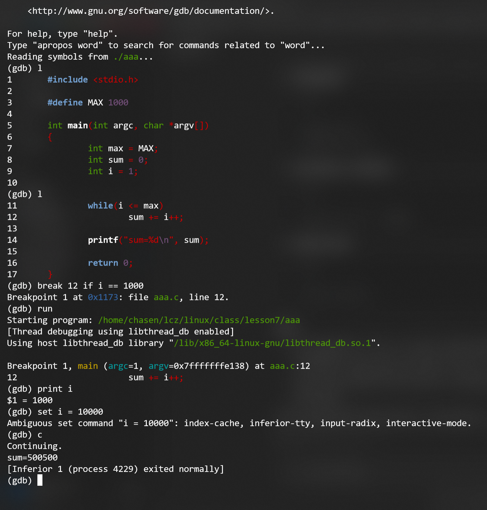

## 1. 问答题

### 1.1. 硬链接和软链接（符号链接）的区别是？

- 硬链接：
  - 硬链接是文件系统中一种创建新目录项的方式，它指向磁盘上的同一个数据块。硬链接不依赖于原始文件路径，它们共享相同的inode编号，意味着硬链接与原文件是完全等价的。删除任何一个硬链接，不会影响其他硬链接和文件内容，文件内容只有在所有硬链接都被删除后，才会被清理

- 软连接：
  - 也叫符号连接，软链接是创建一个指向另一个文件路径的特殊文件，它记录的是**原文件的路径**，而不是数据本身。软链接与原文件的inode号不同，它有自己的inode号，文件内容只是原文件路径的字符串，也就是只存储原始文件的路径，原始文件名字改变会导致软连接失效。


### 1.2. 系统调用和标准库区别？

- 系统调用：是操作系统提供的编程接口，允许用户程序与操作系统内核进行交互。系统调用通常在**内核空间**执行，直接与硬件、内存管理、进程管理等低级操作相关。
- 标准库：标准库是一个**用户空间**的库，封装了常见的操作系统功能和**系统调用**，提供了更高层次的接口。程序员不必直接与系统调用交互，只需要调用标准库提供的函数即可。
- 这两的区别：
  - 实现层次不同：系统调用是系统内核的一部分，直接执行底层硬件或系统资源调用；标准库函数是用户空间的一组函数接口，通常会调用系统调用来实现对应的功能
  - 移植性不同：系统调用是平台和操作系统相关的，移植性较差；标准库函数是通过系统调用实现的，具有较强的移植性。


### 1.3. 假设目前系统的umask为0022，假如编写代码实现creat(“a.txt”, 0765)操作后，请写出文件a.txt的所有者、组用户、其他用户的权限。

umask是系统的**屏蔽掩码**，定义了新文件或目录的权限从默认权限中删去那些权限位

在创建a.txt并且赋予其765，也就是(rwxrw-r-w)权限，之后在对应位置减去umask，因为umask现在是0022(----w--w-)，所以最终得到a.txt的权限为rwxr--r-w。


### 1.4. 编译以下程序


```c
#include <stdio.h>

#define MAX 1000

int main(int argc, char *argv[])
{
        int max = MAX;
        int sum = 0;
        int i = 1;

        while(i <= max)
                sum += i++;

        printf("sum=%d\n", sum);

        return 0;
}
```

以上程序如果想在执行过程中改变，实现sum等于从1加到999，然后再加10000。应该如何做？

提示：采用gdb调试，实现，当变量i==1000时，设置变量i的值为10000，也就是实现从1加到999，然后再加10000。

写出过程，必要时截图。





过程：

1. 先通过vim创建和写入文件
2. 在gcc编译的过程中加入 -g 参数
3. 通过gdb调试
4. break 12 if i == 1000
5. continue
6. set i = 10000
7. continue


## 2. 编程题

### 2.1. 编写程序实现`选择排序`、 `冒泡排序`、 `快速排序`

要求：

键盘输入20个整数进行排序；

然后再输入0、1、2中的一个数值，分别表示采用`选择排序`、 `冒泡排序`还是`快速排序`来排序；

输出从小到大排序结果。

`选择排序`、 `冒泡排序`、 `快速排序`采用三个不同源文件和头文件编写，编译时先将这些源文件编译成`libmysort.a`静态库，然后再编译主程序。


```c
// quick_sort.c

#include "sort.h"

void quick_sort(double arr[], int low, int high) {
  /*
   */
  if (low < high) {
    double pivot = arr[high]; // 以最后一个元素最为枢轴
    int i = low - 1;

    for (int j = low; j < high; j++) {
      if (arr[j] < pivot) {
        i++;
        double temp = arr[i];
        arr[i] = arr[j];
        arr[j] = temp;
      }
    }
    // 交换枢轴元素
    double temp = arr[i + 1];
    arr[i + 1] = arr[high];
    arr[high] = temp;

    int partition_idx = i + 1;

    // 递归
    quick_sort(arr, low, partition_idx - 1);
    quick_sort(arr, partition_idx + 1, high);
  }
}
```

```c
// bubble_sort.c

#include "sort.h"

void bubble_sort(double arr[], int n) {
  for (int i = 0; i < n - 1; i++) {
    for (int j = 0; j < n - i + 1; j++) {
      if (arr[j] > arr[j + 1]) {
        // 如果前面的元素大于后面的元素，就交换
        double temp = arr[j];
        arr[j] = arr[j + 1];
        arr[j + 1] = temp;
      }
    }
  }
}


```

```c
// selection_sort.c

// 导入总的头文件

#include "sort.h"

void selection_sort(double arr[], int n) {
  // O(n^2)
  /* 算法流程:
  先选定一个元素,往后找一个最小的元素,之后和当前元素交换位置*/

  for (int i = 0; i < n - 1; i++) {
    int min_idx = i; // 假设一开始往后最小的下标是自己
                     // 往后遍历所有的元素
    for (int j = i + 1; j < n; j++) {
      if (arr[min_idx] > arr[j]) {
        min_idx = j;
      }
    }
    // 找到了最小的下标，现在进行交换
    double temp = arr[i];
    arr[i] = arr[min_idx];
    arr[min_idx] = temp;
  }
}
```

```c
#include <stdio.h>
#include "sort.h"

int main() {
    double arr[20];  // 用于存放输入的20个double类型的数
    int n = 20;      // 数组大小
    int choice;      // 用户选择的排序算法

    // 输入20个double类型的数
    printf("请输入20个浮点数：\n");
    for (int i = 0; i < n; i++) {
        scanf("%lf", &arr[i]);
    }

    // 输入选择的排序算法
    printf("选择排序算法:\n");
    printf("0 - 选择排序\n1 - 冒泡排序\n2 - 快速排序\n");
    scanf("%d", &choice);

    // 根据用户选择调用不同的排序算法
    switch (choice) {
        case 0:
            selection_sort(arr, n);  // 选择排序
            break;
        case 1:
            bubble_sort(arr, n);  // 冒泡排序
            break;
        case 2:
            quick_sort(arr, 0, n - 1);  // 快速排序
            break;
        default:
            printf("无效的选择!\n");
            return 1;
    }

    // 输出排序后的结果
    printf("排序后的结果为:\n");
    for (int i = 0; i < n; i++) {
        printf("%.2lf ", arr[i]);
    }
    printf("\n");

    return 0;
}
```

```c
#ifndef SORT_H
#define SORT_H

void selection_sort(double arr[], int n);
void bubble_sort(double arr[], int n);
void quick_sort(double arr[], int low, int high);

#endif // 如果没有定义SORT_H就不会编译这一段
```

编译和连接静态库的过程：

```bash
gcc -c selection_sort.c
gcc -c bubble_sort.c
gcc -c quick_sort.c
ar rcs libmysort.a selection_sort.o bubble_sort.o quick_sort.o

gcc main.c -L. -lmysort -o main
./main
```


### 2.2. 编写程序实现拷贝文件功能，该程序运行时有两个参数，分别为源文件和目标文件，程序能够显示打开、读取、写入、关闭文件操作时的错误。

假定编译后的程序名为mycopy，使用方法如下：

`./mycopy src.txt dest.txt`


```c
/* mycopy.c */
#include <stdio.h>
#include <stdlib.h>
#include <unistd.h>
#include <fcntl.h>
#include <errno.h>
#include <string.h>
#include <sys/stat.h>
#include <sys/types.h>

int main(int argc, char *argv[]) {
    if (argc != 3) {
        fprintf(stderr, "用法: %s 源文件 目标文件\n", argv[0]);
        return EXIT_FAILURE;
    }

    const char *src = argv[1];
    const char *dst = argv[2];

    /* 打开源文件 */
    int in_fd = open(src, O_RDONLY);
    if (in_fd < 0) {
        fprintf(stderr, "打开源文件 '%s' 失败: %s\n", src, strerror(errno));
        return EXIT_FAILURE;
    }

    /* 尝试获取源文件权限，用于创建目标文件 */
    struct stat st;
    mode_t mode = 0666; /* 默认权限（被 umask 修改）*/
    if (fstat(in_fd, &st) == 0) {
        mode = st.st_mode & 0777;
    } else {
        /* 获取权限失败，但仍可继续，记录错误信息 */
        fprintf(stderr, "获取源文件 '%s' 属性失败: %s\n", src, strerror(errno));
        /* 不返回，继续使用默认 mode */
    }

    /* 打开/创建目标文件 */
    int out_fd = open(dst, O_WRONLY | O_CREAT | O_TRUNC, mode);
    if (out_fd < 0) {
        fprintf(stderr, "打开/创建目标文件 '%s' 失败: %s\n", dst, strerror(errno));
        if (close(in_fd) < 0) /* 关闭源文件并报告可能的错误 */
            fprintf(stderr, "关闭源文件 '%s' 失败: %s\n", src, strerror(errno));
        return EXIT_FAILURE;
    }

    /* 读取并写入 */
    ssize_t nread;
    char buf[8192];
    while (1) {
        nread = read(in_fd, buf, sizeof(buf));
        if (nread > 0) {
            ssize_t written = 0;
            while (written < nread) {
                ssize_t w = write(out_fd, buf + written, nread - written);
                if (w >= 0) {
                    written += w;
                } else if (errno == EINTR) {
                    /* 被信号中断，重试写 */
                    continue;
                } else {
                    fprintf(stderr, "写入到目标文件 '%s' 出错: %s\n", dst, strerror(errno));
                    /* 尝试关闭文件描述符并报告错误 */
                    if (close(in_fd) < 0)
                        fprintf(stderr, "关闭源文件 '%s' 失败: %s\n", src, strerror(errno));
                    if (close(out_fd) < 0)
                        fprintf(stderr, "关闭目标文件 '%s' 失败: %s\n", dst, strerror(errno));
                    return EXIT_FAILURE;
                }
            }
        } else if (nread == 0) {
            /* 到达 EOF */
            break;
        } else { /* nread < 0 */
            if (errno == EINTR) {
                /* 被信号中断，重试读 */
                continue;
            }
            fprintf(stderr, "从源文件 '%s' 读取失败: %s\n", src, strerror(errno));
            if (close(in_fd) < 0)
                fprintf(stderr, "关闭源文件 '%s' 失败: %s\n", src, strerror(errno));
            if (close(out_fd) < 0)
                fprintf(stderr, "关闭目标文件 '%s' 失败: %s\n", dst, strerror(errno));
            return EXIT_FAILURE;
        }
    }

    /* 关闭文件描述符并检查错误 */
    if (close(in_fd) < 0) {
        fprintf(stderr, "关闭源文件 '%s' 失败: %s\n", src, strerror(errno));
        /* 仍尝试关闭目标文件 */
    }
    if (close(out_fd) < 0) {
        fprintf(stderr, "关闭目标文件 '%s' 失败: %s\n", dst, strerror(errno));
        return EXIT_FAILURE;
    }

    return EXIT_SUCCESS;
}
```

### 2.3. 编写程序实现删除文件功能，该程序运行时有多个参数，可以删除多个参数代表的文件。

- 假定编译后的程序名为myrm，使用方法如下：

`./myrm a.txt b.txt c.txt d.txt`

- 删除时显示删除信息，删除错误时能够显示删除错误。


```c
/* myrm.c */
#include <stdio.h>
#include <stdlib.h>
#include <errno.h>
#include <string.h>

int main(int argc, char *argv[]) {
    if (argc < 2) {
        fprintf(stderr, "用法: %s 文件1 [文件2 ...]\n", argv[0]);
        return 2;
    }

    int exit_code = 0; /* 最终返回码：0 表示全部成功，1 表示有错误 */
    for (int i = 1; i < argc; ++i) {
        const char *path = argv[i];
        if (remove(path) == 0) {
            printf("removed '%s'\n", path);
        } else {
            /* 打印错误信息到 stderr，包含 errno 描述 */
            fprintf(stderr, "cannot remove '%s': %s\n", path, strerror(errno));
            exit_code = 1;
        }
    }

    return exit_code;
}
```

### 2.4.  按以下要求编程。

编程要求：

a.txt中内容如下：

```
Hello World! I am a student of GDUFE! My student NO is 202012345.
```

编写程序，将内容中的两个student都改为teacher，使用文件指针偏移方法。


```c
#include <stdio.h>
#include <stdlib.h>
#include <string.h>

int main(void) {
    const char *filename = "a.txt";
    const char *old = "student";
    const char *neww = "teacher";
    size_t len_old = strlen(old);

    FILE *fp = fopen(filename, "r+"); // 可读可写，不截断
    if (!fp) {
        perror("fopen");
        return 1;
    }

    // 读取整个文件到内存（方便查找匹配位置）
    if (fseek(fp, 0, SEEK_END) != 0) { perror("fseek"); fclose(fp); return 1; }
    long filesize = ftell(fp);
    if (filesize < 0) { perror("ftell"); fclose(fp); return 1; }
    rewind(fp);

    char *buf = malloc(filesize + 1);
    if (!buf) { perror("malloc"); fclose(fp); return 1; }
    if (fread(buf, 1, filesize, fp) != (size_t)filesize) {
        // 可能是空文件或读取错误
    }
    buf[filesize] = '\0';

    // 在内存中查找所有出现的位置
    char *p = buf;
    while ((p = strstr(p, old)) != NULL) {
        long offset = p - buf;           // 相对于文件开始的字节偏移
        if (fseek(fp, offset, SEEK_SET) != 0) { perror("fseek"); break; }
        if (fwrite(neww, 1, len_old, fp) != len_old) { perror("fwrite"); break; }
        fflush(fp);                      // 确保写入文件
        p += len_old;                    // 继续查找下一个（避免无限循环）
    }

    free(buf);
    fclose(fp);

    printf("替换完成。\n");
    return 0;
}
```

### 2.5.  按以下要求编程。

编程要求：

1. 创建文件file1，写入字符串`abcdefghijklmn`
1. 创建文件file2，写入字符串A`BCDEFGHIJKLMN`
1. 读取file1中的内容，写入file2，使file2中的字符串内容为`abcdefghijklmnABCDEFGHIJKLMN`


```c
#include <stdio.h>
#include <stdlib.h>

int main() {
    FILE *fp1, *fp2;
    char buffer[100];
    size_t n;

    // 1. 创建并写入 file1
    fp1 = fopen("file1", "w");
    if (fp1 == NULL) {
        perror("无法创建 file1");
        exit(1);
    }
    fputs("abcdefghijklmn", fp1);
    fclose(fp1);

    // 2. 创建并写入 file2
    fp2 = fopen("file2", "w");
    if (fp2 == NULL) {
        perror("无法创建 file2");
        exit(1);
    }
    fputs("ABCDEFGHIJKLMN", fp2);
    fclose(fp2);

    // 3. 读取 file1 内容并追加写入 file2
    fp1 = fopen("file1", "r");
    if (fp1 == NULL) {
        perror("无法打开 file1");
        exit(1);
    }

    fp2 = fopen("file2", "r+");
    if (fp2 == NULL) {
        perror("无法打开 file2");
        fclose(fp1);
        exit(1);
    }

    // 移动 file2 文件指针到文件末尾
    fseek(fp2, 0, SEEK_END);

    // 从 file1 读取并写入到 file2
    while ((n = fread(buffer, 1, sizeof(buffer), fp1)) > 0) {
        fwrite(buffer, 1, n, fp2);
    }

    fclose(fp1);
    fclose(fp2);

    printf("操作完成！file2 内容已更新为 abcdefghijklmnABCDEFGHIJKLMN\n");
    return 0;
}

```

### 2.6. 文件IO编程：补全下面代码，从一个文件（源文件）中读取后10KB数据并复制到另一个文件（目标文件）。

**请注意：源文件是以只读方式打开的，目标文件是以只写方式打开（可以是读/写方式）的。若目标文件不存在，可以创建并设置权限的初始值为644，即文件所有者可读可写，文件所属组和其他用户只能读。**


```c
// homework5.c

#include <unistd.h>
#include <sys/types.h>
#include <sys/stat.h>
#include <fcntl.h>
#include <stdlib.h>
#include <stdio.h>

#define BUFFER_SIZE 1024 /* 每次读/写缓存大小 */
#define SRC_FILE_NAME "test-s.txt" /* 源文件名 */
#define DEST_FILE_NAME "test-d.txt" /* 目标文件名 */
#define OFFSET 10240 /* 复制的数据大小 */

int main()
{
    int src_file, dest_file;
    unsigned char buff[BUFFER_SIZE];
    int real_read_len;
    off_t file_size;

    /* 以只读方式打开源文件 */
    src_file = open(SRC_FILE_NAME, O_RDONLY);
    if (src_file < 0) {
        perror("open source file");
        exit(1);
    }

    /* 以只写方式打开目标文件，若不存在则创建，权限为644 */
    dest_file = open(DEST_FILE_NAME, O_WRONLY | O_CREAT | O_TRUNC, 0644);
    if (dest_file < 0) {
        perror("open dest file");
        close(src_file);
        exit(1);
    }

    /* 获取源文件大小 */
    file_size = lseek(src_file, 0, SEEK_END);
    if (file_size == -1) {
        perror("lseek to end");
        close(src_file);
        close(dest_file);
        exit(1);
    }

    /* 将读写指针移到源文件后10KB的起始位置 */
    off_t start_pos = (file_size > OFFSET) ? file_size - OFFSET : 0;
    if (lseek(src_file, start_pos, SEEK_SET) == -1) {
        perror("lseek to start");
        close(src_file);
        close(dest_file);
        exit(1);
    }

    /* 读取源文件的后10KB数据并写到目标文件中，每次读写1KB */
    while ((real_read_len = read(src_file, buff, BUFFER_SIZE)) > 0) {
        if (write(dest_file, buff, real_read_len) != real_read_len) {
            perror("write dest file");
            close(src_file);
            close(dest_file);
            exit(1);
        }
    }

    if (real_read_len < 0) {
        perror("read source file");
    }

    close(dest_file);
    close(src_file);
    exit(0);
}

```

### 2.7. 创建新文件aa.txt，内容“Hello World!”，该文件具有用户读写权限。采用fcntl 复制一个新的文件描述符，通过新文件描述符向文件末尾写入“Linux is an open source OS.”字符串。


```c
// create_and_append.c
#include <unistd.h>
#include <fcntl.h>
#include <sys/stat.h>
#include <stdlib.h>
#include <stdio.h>
#include <string.h>

int main(void)
{
    const char *filename = "aa.txt";
    const char *initial = "Hello World!";
    const char *append = "Linux is an open source OS.";

    /* 以读写方式打开（若不存在则创建），并且截断已有文件，权限为用户读写 0600 */
    int fd = open(filename, O_RDWR | O_CREAT | O_TRUNC, S_IRUSR | S_IWUSR);
    if (fd < 0) {
        perror("open");
        exit(EXIT_FAILURE);
    }

    /* 写入初始内容 "Hello World!" */
    ssize_t written = write(fd, initial, strlen(initial));
    if (written < 0 || (size_t)written != strlen(initial)) {
        perror("write initial");
        close(fd);
        exit(EXIT_FAILURE);
    }

    /*
     * 使用 fcntl 复制一个新的文件描述符（等价于 dup，但题目要求用 fcntl）
     * F_DUPFD 的第三个参数是从哪个描述符编号开始搜索可用描述符（通常传 0 或 3）
     */
    int newfd = fcntl(fd, F_DUPFD, 0);
    if (newfd < 0) {
        perror("fcntl(F_DUPFD)");
        close(fd);
        exit(EXIT_FAILURE);
    }

    /*
     * 确保写入发生在文件末尾。
     * 注意：通过 fcntl/dup 复制得到的描述符与原描述符共享同一个 open-file description，
     * 因此它们共享文件偏移。由于我们刚写完初始内容，偏移通常已经位于文件末尾。
     * 但为了明确起见，这里显式将偏移移动到文件末尾（等同于 append）。
     */
    if (lseek(newfd, 0, SEEK_END) == (off_t)-1) {
        perror("lseek");
        close(newfd);
        close(fd);
        exit(EXIT_FAILURE);
    }

    /* 通过新文件描述符向文件末尾写入附加字符串 */
    written = write(newfd, append, strlen(append));
    if (written < 0 || (size_t)written != strlen(append)) {
        perror("write append");
        close(newfd);
        close(fd);
        exit(EXIT_FAILURE);
    }

    /* 关闭文件描述符 */
    close(newfd);
    close(fd);

    printf("完成：%s 已创建并追加内容。\n", filename);
    return 0;
}

```

### 2.8. 编写程序，对未知txt文件word.txt中所有的is修改成are。如果存在is，就进行修改；如果不存在is，就不做修改。

注意：word.txt文件由自己编写测试。


```c
// replace_is_are.c
#include <stdio.h>
#include <stdlib.h>
#include <unistd.h>
#include <fcntl.h>
#include <sys/stat.h>
#include <string.h>
#include <ctype.h>
#include <errno.h>

#define SRC_FILENAME "word.txt"
#define TMP_TEMPLATE  "word.txt.tmp.XXXXXX"
#define PAT "is"
#define REPL "are"

int is_word_boundary(char ch) {
    /* 把字母和数字视为“单词字符”，其他视为边界 */
    return (ch == '\0') || (!isalnum((unsigned char)ch));
}

int main(void) {
    int fd = -1, tmpfd = -1;
    struct stat st;
    char *buf = NULL;
    size_t size = 0;
    ssize_t r;
    size_t i, count = 0;
    size_t patlen = strlen(PAT);
    size_t repllen = strlen(REPL);

    /* 打开源文件读入 */
    fd = open(SRC_FILENAME, O_RDONLY);
    if (fd < 0) {
        perror("open source file");
        return 1;
    }

    if (fstat(fd, &st) < 0) {
        perror("fstat");
        close(fd);
        return 1;
    }

    /* 如果是空文件直接退出 */
    if (st.st_size == 0) {
        printf("%s is empty. nothing to do.\n", SRC_FILENAME);
        close(fd);
        return 0;
    }

    size = (size_t)st.st_size;
    buf = malloc(size + 1);
    if (!buf) {
        perror("malloc");
        close(fd);
        return 1;
    }

    /* 读取全部内容 */
    {
        size_t off = 0;
        while (off < size) {
            r = read(fd, buf + off, size - off);
            if (r < 0) {
                if (errno == EINTR) continue;
                perror("read");
                free(buf);
                close(fd);
                return 1;
            }
            if (r == 0) break;
            off += (size_t)r;
        }
    }
    buf[size] = '\0';
    close(fd);
    fd = -1;

    /* 统计满足“单词 is”条件的出现次数（为了分配新缓冲区大小） */
    for (i = 0; i + patlen <= size; ++i) {
        if (buf[i] == 'i' && buf[i+1] == 's') {
            char prev = (i == 0) ? '\0' : buf[i-1];
            char next = (i + patlen >= size) ? '\0' : buf[i + patlen];
            if (is_word_boundary(prev) && is_word_boundary(next)) {
                ++count;
                i += patlen - 1; /* 跳过已匹配部分 */
            }
        }
    }

    if (count == 0) {
        printf("没有找到单词 \"is\"，不做修改。\n");
        free(buf);
        return 0;
    }

    /* 分配新缓冲区并构造替换后的内容 */
    {
        size_t new_size = size + count * (repllen - patlen);
        char *newbuf = malloc(new_size + 1);
        if (!newbuf) {
            perror("malloc newbuf");
            free(buf);
            return 1;
        }
        size_t ni = 0;
        for (i = 0; i < size; ++i) {
            if (i + patlen <= size && buf[i] == 'i' && buf[i+1] == 's') {
                char prev = (i == 0) ? '\0' : buf[i-1];
                char next = (i + patlen >= size) ? '\0' : buf[i + patlen];
                if (is_word_boundary(prev) && is_word_boundary(next)) {
                    /* 替换 */
                    memcpy(newbuf + ni, REPL, repllen);
                    ni += repllen;
                    i += patlen - 1; /* 跳过匹配 */
                    continue;
                }
            }
            /* 否则原样拷贝当前字符 */
            newbuf[ni++] = buf[i];
        }
        newbuf[ni] = '\0';

        /* 将结果写入临时文件，再重命名覆盖原文件 */
        char tmpname[] = TMP_TEMPLATE;
        tmpfd = mkstemp(tmpname);
        if (tmpfd < 0) {
            perror("mkstemp");
            free(newbuf);
            free(buf);
            return 1;
        }

        /* 保持临时文件权限与原文件相同 */
        if (fchmod(tmpfd, st.st_mode & 07777) < 0) {
            /* 不致命，记录警告 */
            perror("fchmod");
        }

        /* 写入临时文件 */
        size_t written = 0;
        while (written < ni) {
            ssize_t w = write(tmpfd, newbuf + written, ni - written);
            if (w < 0) {
                if (errno == EINTR) continue;
                perror("write tmp");
                close(tmpfd);
                unlink(tmpname);
                free(newbuf);
                free(buf);
                return 1;
            }
            written += (size_t)w;
        }

        /* 确保数据刷入磁盘（可选但更安全） */
        fsync(tmpfd);
        close(tmpfd);
        tmpfd = -1;

        /* 用临时文件替换原文件 */
        if (rename(tmpname, SRC_FILENAME) < 0) {
            perror("rename");
            unlink(tmpname);
            free(newbuf);
            free(buf);
            return 1;
        }

        printf("已替换 %zu 处 \"is\" -> \"are\"，并已保存到 %s\n", count, SRC_FILENAME);

        free(newbuf);
    }

    free(buf);
    return 0;
}

```
