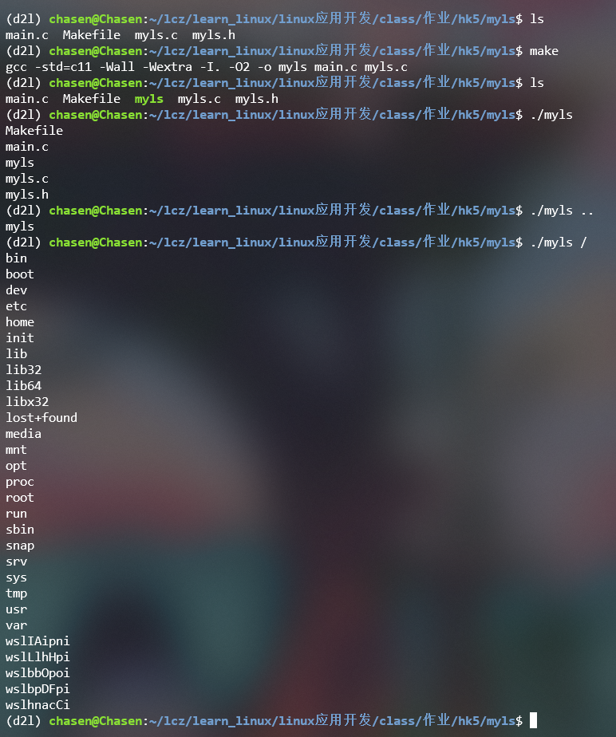

## 1. 编程题

### 1.1. 编写类似ls命令的程序myls，能够实现在屏幕上显示目录下文件功能。

要求：
1. 如果直接运行`./myls`，则打印当前目录下所有文件名称
1. 如果运行`./myls  <dirpath>`，则打印path下所有文件名称



myls.h:
```c
#ifndef MYLS_H
#define MYLS_H

#include <stdio.h>

/*
 * 列出 directory 路径下的文件名（每行一个），输出到 out（通常是 stdout）。
 * show_hidden: 非零则显示以 '.' 开头的隐藏文件；否则隐藏。
 * 返回 0 表示成功，非 0 表示失败（并在 stderr 输出错误信息）。
 */
int list_directory(const char *directory, int show_hidden, FILE *out);

/*
 * 如果 path 是目录则列出其内容（调用 list_directory），
 * 否则（普通文件）打印路径的最后一段（basename）。
 * show_hidden 同上，out 同上。
 */
int print_path_or_file(const char *path, int show_hidden, FILE *out);

#endif /* MYLS_H */
```

myls.c:
```c
#define _POSIX_C_SOURCE 200809L
#include "myls.h"
#include <stdio.h>
#include <stdlib.h>
#include <string.h>
#include <dirent.h>
#include <sys/stat.h>
#include <errno.h>

/* 如果系统没有 strdup，可用此替代 */
#ifndef HAVE_STRDUP
static char *local_strdup(const char *s) {
    if (!s) return NULL;
    size_t len = strlen(s) + 1;
    char *p = malloc(len);
    if (p) memcpy(p, s, len);
    return p;
}
#define strdup local_strdup
#endif

static int cmp_cstring(const void *a, const void *b) {
    const char * const *pa = a;
    const char * const *pb = b;
    return strcmp(*pa, *pb);
}

int list_directory(const char *directory, int show_hidden, FILE *out) {
    if (!directory || !out) {
        fprintf(stderr, "list_directory: invalid arguments\n");
        return -1;
    }

    DIR *dp = opendir(directory);
    if (!dp) {
        fprintf(stderr, "opendir(%s) failed: %s\n", directory, strerror(errno));
        return -1;
    }

    struct dirent *entry;
    char **names = NULL;
    size_t cap = 0, n = 0;

    while ((entry = readdir(dp)) != NULL) {
        const char *name = entry->d_name;
        /* 跳过 . 和 .. */
        if (strcmp(name, ".") == 0 || strcmp(name, "..") == 0) continue;
        /* 根据 show_hidden 决定是否跳过以 '.' 开头的隐藏文件 */
        if (!show_hidden && name[0] == '.') continue;

        if (n + 1 > cap) {
            size_t newcap = cap == 0 ? 32 : cap * 2;
            char **tmp = realloc(names, newcap * sizeof(char *));
            if (!tmp) {
                perror("realloc");
                for (size_t i = 0; i < n; ++i) free(names[i]);
                free(names);
                closedir(dp);
                return -1;
            }
            names = tmp;
            cap = newcap;
        }

        names[n] = strdup(name);
        if (!names[n]) {
            perror("strdup");
            for (size_t i = 0; i < n; ++i) free(names[i]);
            free(names);
            closedir(dp);
            return -1;
        }
        n++;
    }

    closedir(dp);

    if (n > 0) {
        qsort(names, n, sizeof(char *), cmp_cstring);
        for (size_t i = 0; i < n; ++i) {
            fprintf(out, "%s\n", names[i]);
            free(names[i]);
        }
    }

    free(names);
    return 0;
}

int print_path_or_file(const char *path, int show_hidden, FILE *out) {
    if (!path || !out) {
        fprintf(stderr, "print_path_or_file: invalid arguments\n");
        return -1;
    }

    struct stat st;
    if (stat(path, &st) != 0) {
        fprintf(stderr, "stat(%s) failed: %s\n", path, strerror(errno));
        return -1;
    }

    if (S_ISDIR(st.st_mode)) {
        return list_directory(path, show_hidden, out);
    } else {
        const char *p = strrchr(path, '/');
        if (p) fprintf(out, "%s\n", p + 1);
        else fprintf(out, "%s\n", path);
        return 0;
    }
}
```

main.c:
```c
#include "myls.h"
#include <stdio.h>
#include <stdlib.h>

/* 简单版本：用法 ./myls 或 ./myls <path>
 * 默认不显示隐藏文件（与 ls 默认行为一致）。
 * 如果你想要 -a 支持，可在此加入 getopt 解析（可按需扩展）。
 */

int main(int argc, char *argv[]) {
    const char *path = ".";
    if (argc == 1) {
        path = ".";
    } else if (argc == 2) {
        path = argv[1];
    } else {
        fprintf(stderr, "Usage: %s [path]\n", argv[0]);
        return 2;
    }

    int ret = print_path_or_file(path, /*show_hidden=*/0, stdout);
    return ret == 0 ? 0 : 1;
}
```


### 1.2. 编写程序createfiles，能够实现一次性创建目录和文件功能。

要求：
1. 使用方法：`./createfiles   <dirname>  <文件数量>`
1. 例如：`./createfiles   ddd   8`
    
```就是创建ddd目录，并在ddd目录下创建1.txt、2.txt一直到8.txt八个文件，文件内容可为空。```


```c

```

### 1.3. 编写程序myrmdir能够删除某个目录，以及目录下所有的文件。

要求：
1. `./myrmdir   <dirname>`
1. 如果目录下为空，就只删除目录
1. 如果目录不为空就先删除目录下所有文件，再删除目录
1. 假定`<dirname>`下不存在其他正常目录

注意：由于Linux目录中总是存在”.“、”..“两个隐藏目录，所以在用readdir()函数判断是否为空时，得到的结果总是目录不为空。所以要排除这两个隐藏目录。


```c

```

### 1.4. 编写程序cpdir，实现目录拷贝功能。

要求：
1. `./cpdir   <src_dir>   <dest_dir>`
1. 拷贝目录下所有文件
1. dest_dir不存在，就新建；如存在就直接拷贝src_dir下所有文件到dir_dir中


```python

```

### 1.5. 采用库函数方式编写文件操作主程序`dowithfiles`，具备创建目录、复制目录、删除目录、更名目录、复制文件、删除文件、更名文件（先复制后删除）七大功能。

要求：
1. 创建目录：`./dowithfiles   mkdir   <dirname>`
1. 复制目录：`./dowithfiles   cpdir   <src_dir>   <dest_dir>`
1. 删除目录：`./dowithfiles   rmdir   <dirname>`
1. 更名目录：`./dowithfiles   renamedir   <dirname>`
1. 复制文件：`./dowithfiles   cp   <filename>`
1. 删除文件：`./dowithfiles   rm   <filename>`
1. 更名文件：`./dowithfiles   rename   <old_name>   <new_name>`


```python

```
