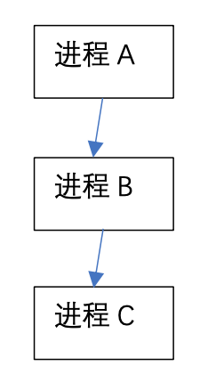
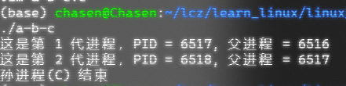
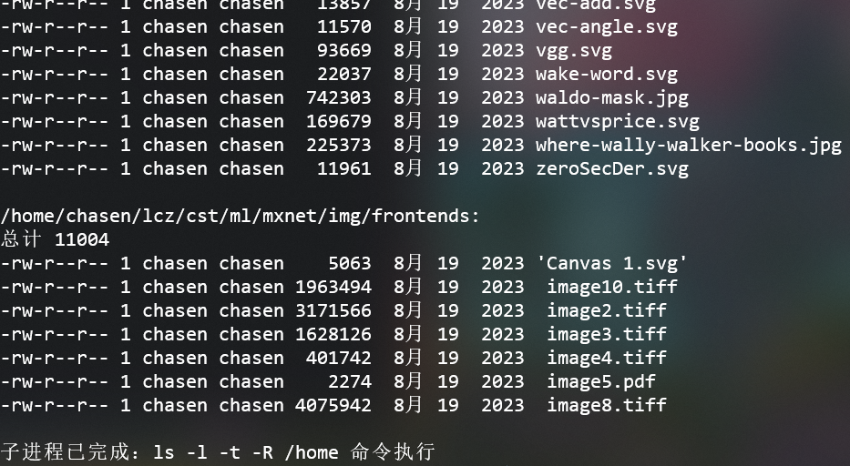
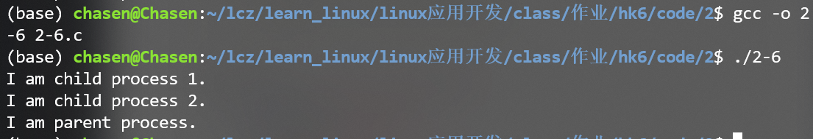
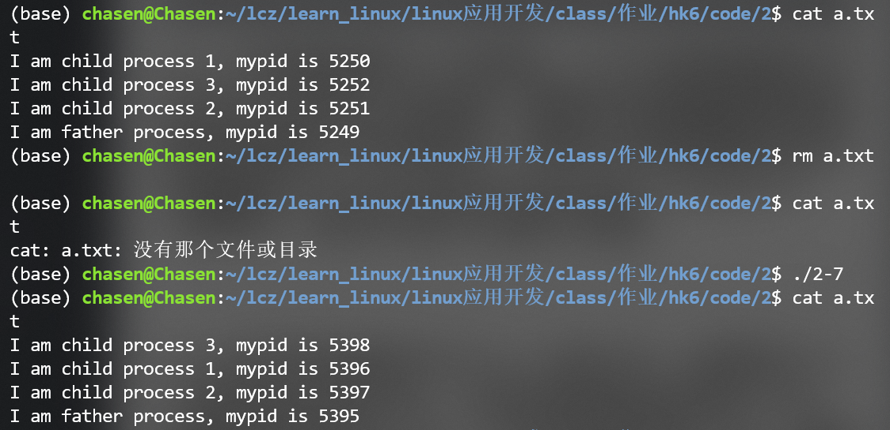
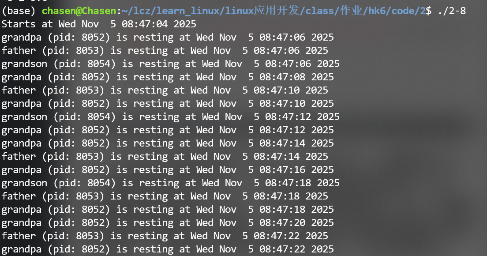
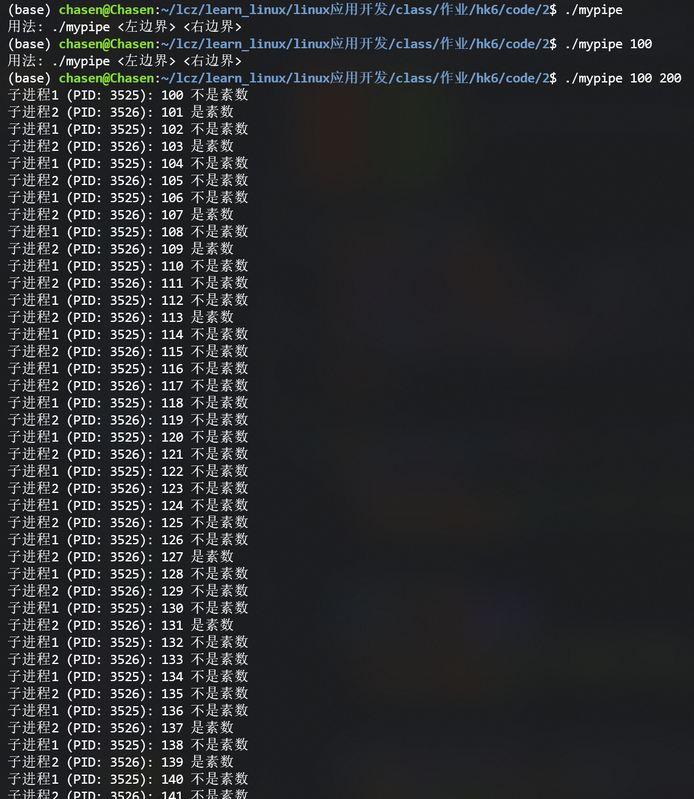
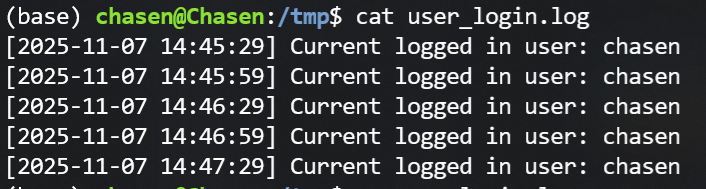

## 1. 分析题

### 1.1. 分析以下代码


```c
#include <unistd.h>
#include <stdio.h>

void main()
{
        for(int i=0;i<4;i++) {
                pid_t pid=fork();
                if(pid>0)
                        sleep(1);
        }
        printf("My pid is %d, and my parent pid is %d\n",getpid(),getppid());
}
```

请分析上述代码一共输出多少行，并画出进程的创建过程。

**回答**：

应该输出了16行，2^4 - 1个子进程被创建


## 2. 编程题

### 2.1. 编写一个程序，实现下面的进程关系，不创建多余的进程。（A是祖先进程，C是孙子进程），要防止出现僵尸进程。




```c
#include <stdio.h>
#include <stdlib.h>
#include <unistd.h>
#include <sys/wait.h>

int main() {
    pid_t pid;
    int i;

    for (i = 0; i < 2; i++) {   // 创建 2 次，形成 A->B->C
        pid = fork();

        if (pid < 0) {
            perror("fork 失败");
            exit(1);
        } 
        else if (pid == 0) {
            // 子进程执行
            printf("这是第 %d 代进程，PID = %d, 父进程 = %d\n", i + 1, getpid(), getppid());
            // 除最后一个（C进程）外继续循环创建下一级
            if (i == 1) {
                sleep(1);
                printf("孙进程(C) 结束\n");
            }
        } 
        else {
            // 父进程等待子进程结束，防止僵尸
            wait(NULL);
            // 创建完一个子进程后父进程退出循环
            break;
        }
    }

    return 0;
}


```
截图


### 2.2. 编写一个程序，创建两个子进程，父进程在屏幕上输出10个字符A，两个子进程分别输出10个B和C，要求父进程在两个子进程输出完字符后再输出自己的字符。


```c
#include <stdio.h>    // 提供输入输出函数
#include <stdlib.h>   // 提供进程退出等函数
#include <unistd.h>   // 提供fork()等系统调用
#include <sys/wait.h> // 提供wait()等进程等待函数

int main() {
    // 创建第一个子进程（输出B）
    pid_t pid1 = fork();
    if (pid1 == -1) {
        perror("fork创建第一个子进程失败");
        exit(EXIT_FAILURE); // 退出程序并返回错误状态
    } else if (pid1 == 0) { // 第一个子进程执行逻辑
        for (int i = 0; i < 10; i++) {
            printf("B");
            fflush(stdout); // 立即刷新缓冲区，确保字符及时输出
        }
        exit(EXIT_SUCCESS); // 子进程完成任务后退出
    }

    // 创建第二个子进程（输出C）
    pid_t pid2 = fork();
    if (pid2 == -1) {
        perror("fork创建第二个子进程失败");
        exit(EXIT_FAILURE);
    } else if (pid2 == 0) { // 第二个子进程执行逻辑
        for (int i = 0; i < 10; i++) {
            printf("C");
            fflush(stdout);
        }
        exit(EXIT_SUCCESS);
    }

    // 父进程逻辑：等待两个子进程完成后输出A
    wait(NULL);  // 等待第一个子进程结束
    wait(NULL);  // 等待第二个子进程结束

    // 输出10个A
    for (int i = 0; i < 10; i++) {
        printf("A");
    }
    printf("\n"); // 最后换行，使输出更规范

    return 0;
}
```

### 2.3. 采用创建子进程，并使用exec家族函数实现以下指令功能（编程实现，不要在终端直接运行shell命令）：

`ls -l -t -R /home`



```c
// 2-3.c 
// 通过子进程调用exec家族函数

#include <stdio.h> // 标准库
#include <stdlib.h> 
#include <unistd.h> // fork(), execlp()
#include <sys/wait.h> // wait()


int main()
{
    pid_t pid = fork();

    if (pid < 0) {
        // 如果进程创建失败
        perror("失败");
        exit(EXIT_FAILURE); // failure
    } else if (pid == 0) {
        // ls -l -t -R /home
        /* 
         * execlp参数说明：
         * 1. 第一个参数"ls"：要执行的程序名（依赖PATH环境变量查找）
         * 2. 后续参数：命令行参数列表，格式与终端输入一致
         *    - "ls"：第一个参数通常为程序名自身（对应argv[0]）
         *    - "-l"、"-t"、"-R"：ls的选项（详细列表、按时间排序、递归显示）
         *    - "/home"：要查询的目录路径
         * 3. 最后必须以NULL结尾，标记参数列表结束
         */
        execlp("ls", "ls", "-l", "-t", "-R", "/home/chasen/lcz", NULL);

        perror("execlp执行失败");
        exit(EXIT_FAILURE);
    } else {
        wait(NULL);
        printf("\n子进程已完成：ls -l -t -R /home 命令执行\n");
    }

    return 0;
}
```

### 2.4. 编写守护进程，利用守护进程向日志文件/tmp/time.log间隔5秒循环写入当前系统时间等。

提示：
- 间隔10秒：sleep(10)
- 获取系统时间：

```
time_t t=time(NULL);
struct tm *tp=localtime(&t);
strftime(buff,sizeof(buff),"%Y-%m-%d %H:%M:%S",tp);
```


```python

```

### 2.5. 编写自己的shell程序，该shell程序的终端提示符为\$，退出采用exit，执行程序样式如下：

```
$ls
bin  boot  cdrom  dev  etc  home  lib  lib32  lib64  libx32  lost+found  media  mnt  opt  proc  root  run
$ps -u
USER         PID %CPU %MEM    VSZ   RSS TTY      STAT START   TIME COMMAND
linux       8351  0.0  0.0  14556  5760 pts/0    Ss   11:50   0:00 -bash
linux       9145  0.0  0.0  15776  1560 pts/0    R+   14:56   0:00 ps -u
```

`$exit`退出shell


```c
// cal_simplified.c
// 简单的 shell（使用 signal() 注册 SIGCHLD）

#include <stdio.h>
#include <stdlib.h>
#include <string.h>
#include <unistd.h>
#include <sys/types.h>
#include <sys/wait.h>
#include <signal.h>
#include <ctype.h>
#include <errno.h>

#define BUF_SIZE 1024
#define MAX_ARGS 100

// SIGCHLD 处理函数：回收后台子进程，避免产生僵尸进程
void sigchld_handler(int sig)
{
    int saved_errno = errno;
    while (1) {
        pid_t pid = waitpid(-1, NULL, WNOHANG);
        if (pid <= 0) break;
        // 可选：打印已结束的后台进程信息
        // printf("[info] child %d exited\n", pid);
    }
    errno = saved_errno;
}

int main(int argc, char *argv[])
{
    if (signal(SIGCHLD, sigchld_handler) == SIG_ERR) {
        perror("signal");
        exit(EXIT_FAILURE);
    }

    char command[BUF_SIZE];
    char *args[MAX_ARGS];

    while (1) {
        printf("(~_~):");
        if (fgets(command, sizeof(command), stdin) == NULL) {
            // Ctrl-D 或 输入流结束
            printf("\n");
            break;
        }

        // 去掉末尾换行
        size_t len = strlen(command);
        if (len > 0 && command[len-1] == '\n') command[len-1] = '\0';

        // 跳过前导空白
        char *cmd = command;
        while (*cmd && isspace((unsigned char)*cmd)) cmd++;
        if (*cmd == '\0') continue; // 空命令

        // 内建命令退出
        if (strcmp(cmd, "quit") == 0 || strcmp(cmd, "exit") == 0) break;

        // 检查是否后台运行（以 & 结尾，或单独包含 &）
        int background = 0;
        len = strlen(cmd);
        // 去掉尾部空白
        while (len > 0 && isspace((unsigned char)cmd[len-1])) cmd[--len] = '\0';
        if (len > 0 && cmd[len-1] == '&') {
            background = 1;
            cmd[--len] = '\0';
            while (len > 0 && isspace((unsigned char)cmd[len-1])) cmd[--len] = '\0';
        }

        // 分词
        int i = 0;
        char *token = strtok(cmd, " \t");
        while (token != NULL && i < MAX_ARGS-1) {
            if (strcmp(token, "&") == 0) { background = 1; break; }
            args[i++] = token;
            token = strtok(NULL, " \t");
        }
        args[i] = NULL;
        if (i == 0) continue;

        // 内建命令：cd
        if (strcmp(args[0], "cd") == 0) {
            if (args[1] == NULL) {
                char *home = getenv("HOME");
                if (home == NULL) home = "/";
                if (chdir(home) != 0) perror("cd");
            } else {
                if (chdir(args[1]) != 0) perror("cd");
            }
            continue;
        }

        // 创建子进程执行外部命令
        pid_t pid = fork();
        if (pid < 0) {
            perror("fork");
            continue;
        } else if (pid == 0) {
            // 子进程：执行命令
            execvp(args[0], args);
            // execvp 返回说明出错
            perror("execvp");
            exit(EXIT_FAILURE);
        } else {
            // 父进程
            if (!background) {
                int status;
                if (waitpid(pid, &status, 0) == -1) perror("waitpid");
            } else {
                printf("[background] pid %d\n", pid);
                // SIGCHLD 处理器会回收后台结束的子进程
            }
        }
    }

    return 0;
}

```

### 2.6. 编写一个程序，创建两个子进程，父进程在屏幕上输出“I am parent process.”，两个子进程分别输出” I am child process 1.”、” I am child process 2.”，要求父进程在两个子进程输出完字符后再输出自己的字符。




```c
// 2-4.c
// 父进程创建两个子进程，子进程执行完成之后父进程再执行

#include <stdio.h>
#include <stdlib.h>
#include <unistd.h>
#include <sys/types.h>
#include <sys/wait.h>

int main()
{
    // 通过for循环创建两个子进程
    // 子进程输出I am child process X.
    // 父进程输出I am parent process.

    for (int i = 0; i < 2; i++) {
        pid_t pid = fork();
        if (pid < 0) {
            perror("Fork failed");
            exit(EXIT_FAILURE);
        } else if (pid == 0) {
            // 子进程
            printf("I am child process %d.\n", i + 1);
            exit(EXIT_SUCCESS);
        } else {
            // 等待子进程结束
            // wait(NULL);
            waitpid(pid, NULL, 0);
            // wait 和 waitpid 的区别在于 wait 会等待任意一个子进程结束，
            // 而 waitpid 可以指定等待特定的子进程结束。
        }
    }
    printf("I am parent process.\n");


    return 0;
}
```

### 2.7. 父进程创建3个子进程，3个子进程需要打开文件a.txt并写入字符串，要求字符串能表明身份同时写明自己的进程号，最后父进程需要在该文件里面写入“I am father process, mypid is”+进程号。要求不能产生僵尸进程。



两次执行的写入顺序不太一样，是因为三个子进程是并发执行的。

```c
#include <stdio.h>
#include <stdlib.h>
#include <unistd.h>
#include <sys/wait.h>

int main() {
    // 获取父进程PID
    pid_t father_pid = getpid();
    int i;

    // 创建3个子进程
    for (i = 0; i < 3; i++) {
        pid_t pid = fork();
        if (pid == -1) {  // 错误处理
            perror("fork failed");
            exit(EXIT_FAILURE);
        } else if (pid == 0) {  // 子进程逻辑
            // 子进程获取自身PID
            pid_t child_pid = getpid();
            // 打开文件（追加模式，避免覆盖）
            FILE *fp = fopen("a.txt", "a");
            if (fp == NULL) {
                perror("fopen failed");
                exit(EXIT_FAILURE);
            }
            // 写入子进程信息（表明身份和PID）
            fprintf(fp, "I am child process %d, mypid is %d\n", i + 1, child_pid);
            fclose(fp);  // 关闭文件
            exit(EXIT_SUCCESS);  // 子进程退出，避免继续执行父进程代码
        }
        // 父进程继续创建下一个子进程
    }

    // 父进程等待所有子进程结束,避免僵尸进程
    for (i = 0; i < 3; i++) {
        wait(NULL);  // 每次等待一个子进程回收
    }

    // 父进程写入自身信息
    FILE *fp = fopen("a.txt", "a");
    if (fp == NULL) {
        perror("fopen failed");
        exit(EXIT_FAILURE);
    }
    fprintf(fp, "I am father process, mypid is %d\n", father_pid);
    fclose(fp);

    return 0;
}
```

### 2.8. 有爷爷爸爸孙子三人一起工作，前两秒三人一起休息讨论工作，之后爷爷每2秒休息一次，爸爸每4秒休息一次，儿子每6秒休息一次，请按照关系创建父子进程，每人每次休息时都打印他的身份、进程pid以及当前时间，工作时间为18s。




```c
#include <stdio.h>
#include <stdlib.h>
#include <unistd.h>
#include <sys/wait.h>
#include <time.h>

// 打印休息信息：身份、PID、当前时间
void print_rest(const char* role, pid_t pid) {
    time_t now = time(NULL);
    printf("%s (pid: %d) is resting at %s", role, pid, ctime(&now));
}

int main() {
    time_t start_time = time(NULL);  // 记录程序开始时间（基准时间）
    printf("Starts at %s", ctime(&start_time));
    pid_t pid;

    // 爷爷进程创建爸爸进程
    pid = fork();
    if (pid == -1) {
        perror("fork dad failed");
        exit(1);
    } else if (pid == 0) {  // 爸爸进程
        // 爸爸进程创建孙子进程
        pid = fork();
        if (pid == -1) {
            perror("fork son failed");
            exit(1);
        } else if (pid == 0) {  // 孙子进程
            const char* role = "grandson";
            pid_t my_pid = getpid();
            int interval = 6;  // 孙子每6秒休息一次
            time_t next_rest = start_time + 2;  // 前2秒后首次休息

            // 工作时间18秒内，循环休息
            while (next_rest - start_time <= 18) {
                time_t now = time(NULL);
                if (now < next_rest) {
                    sleep(next_rest - now);  // 等待到下一次休息时间
                }
                print_rest(role, my_pid);
                next_rest += interval;  // 更新下一次休息时间
            }
            exit(0);  // 孙子进程结束
        } else {  // 爸爸进程（等待孙子结束）
            const char* role = "father";
            pid_t my_pid = getpid();
            int interval = 4;  // 爸爸每4秒休息一次
            time_t next_rest = start_time + 2;

            while (next_rest - start_time <= 18) {
                time_t now = time(NULL);
                if (now < next_rest) {
                    sleep(next_rest - now);
                }
                print_rest(role, my_pid);
                next_rest += interval;
            }
            wait(NULL);  // 回收孙子进程，避免僵尸
            exit(0);
        }
    } else {  // 爷爷进程（等待爸爸结束）
        const char* role = "grandpa";
        pid_t my_pid = getpid();
        int interval = 2;  // 爷爷每2秒休息一次
        time_t next_rest = start_time + 2;

        while (next_rest - start_time <= 18) {
            time_t now = time(NULL);
            if (now < next_rest) {
                sleep(next_rest - now);
            }
            print_rest(role, my_pid);
            next_rest += interval;
        }
        wait(NULL);  // 回收爸爸进程，避免僵尸
        exit(0);
    }

    return 0;
}
```

### 2.9. 编写程序让两个子进程对交替判断一个范围的数是不是素数。运行程序时要输入两个参数，一个是左边界，一个是右边界。比如说判断100到200里哪些是素数，子进程1判断100是不是素数，子进程2判断101是不是素数，子进程1再判断102是不是素数，一直轮流下去。



```c
// 2-9.c
// 使用两个子进程交替判断一个范围内的数字是否为素数

#include <stdio.h>
#include <stdlib.h>
#include <unistd.h> // fork, pipe, read, write, close
#include <sys/wait.h>
#include <string.h>
#include <math.h> 

// 判断一个数是否为素数
int is_prime(int num) {
    if (num <= 1) return 0;    // 小于等于1不是素数
    if (num == 2) return 1;    // 2是素数
    if (num % 2 == 0) return 0; // 偶数不是素数
    for (int i = 3; i*i <= num; i += 2) {
        if (num % i == 0) return 0;
    }
    return 1;
}

int main(int argc, char *argv[]) { // argc: 参数个数, argv: 参数数组
    // 检查命令行参数
    if (argc != 3) {
        fprintf(stderr, "用法: %s <左边界> <右边界>\n", argv[0]);
        exit(EXIT_FAILURE);
    }

    // 解析参数为整数
    int left = atoi(argv[1]);
    int right = atoi(argv[2]);
    if (left < 0 || right < 0 || left > right) {
        fprintf(stderr, "错误: 无效的范围（左边界<=右边界，且均为非负数）\n");
        exit(EXIT_FAILURE);
    }

    // 创建两个管道用于进程同步（子进程1→子进程2，子进程2→子进程1）
    int pipe1[2], pipe2[2]; // pipe1[0]: 读端, pipe1[1]: 写端
    if (pipe(pipe1) == -1 || pipe(pipe2) == -1) {
        perror("pipe创建失败");
        exit(EXIT_FAILURE);
    }

    // 创建第一个子进程（处理偶数索引的数字）
    pid_t child1 = fork();
    if (child1 == -1) {
        perror("fork子进程1失败");
        exit(EXIT_FAILURE);
    }

    if (child1 == 0) {  // 子进程1逻辑
        // 关闭不需要的管道端（只保留写pipe1，读pipe2）
        close(pipe1[0]);
        close(pipe2[1]);

        // 遍历范围内的数字
        for (int i = left; i <= right; i++) {
            int diff = i - left;
            if (diff % 2 == 0) {  // 偶数索引（0,2,4...）由子进程1处理
                // 判断素数并输出结果
                int prime = is_prime(i);
                printf("子进程1 (PID: %d): %d %s素数\n", 
                       getpid(), i, prime ? "是" : "不是");

                // 处理完后发送信号给子进程2，通知其可以处理下一个
                char buf = 'a';
                if (write(pipe1[1], &buf, 1) == -1) {
                    perror("子进程1写管道失败");
                    exit(EXIT_FAILURE);
                }
            } else {  // 等待子进程2处理完奇数索引后再继续
                char buf;
                if (read(pipe2[0], &buf, 1) == -1) {
                    perror("子进程1读管道失败");
                    exit(EXIT_FAILURE);
                }
            }
        }

        // 关闭管道并退出
        close(pipe1[1]);
        close(pipe2[0]);
        exit(EXIT_SUCCESS);
    }

    // 创建第二个子进程（处理奇数索引的数字）
    pid_t child2 = fork();
    if (child2 == -1) {
        perror("fork子进程2失败");
        exit(EXIT_FAILURE);
    }

    if (child2 == 0) {  // 子进程2逻辑
        // 关闭不需要的管道端（只保留读pipe1，写pipe2）
        close(pipe1[1]);
        close(pipe2[0]);

        // 遍历范围内的数字
        for (int i = left; i <= right; i++) {
            int diff = i - left;
            if (diff % 2 == 1) {  // 奇数索引（1,3,5...）由子进程2处理
                // 先等待子进程1的信号（确保交替执行）
                char buf;
                if (read(pipe1[0], &buf, 1) == -1) {
                    perror("子进程2读管道失败");
                    exit(EXIT_FAILURE);
                }

                // 判断素数并输出结果
                int prime = is_prime(i);
                printf("子进程2 (PID: %d): %d %s素数\n", 
                       getpid(), i, prime ? "是" : "不是");

                // 处理完后发送信号给子进程1，通知其可以处理下一个
                if (write(pipe2[1], &buf, 1) == -1) {
                    perror("子进程2写管道失败");
                    exit(EXIT_FAILURE);
                }
            }
        }

        // 关闭管道并退出
        close(pipe1[0]);
        close(pipe2[1]);
        exit(EXIT_SUCCESS);
    }

    // 父进程逻辑：关闭所有管道，等待子进程结束
    close(pipe1[0]);
    close(pipe1[1]);
    close(pipe2[0]);
    close(pipe2[1]);

    // 等待两个子进程完成
    waitpid(child1, NULL, 0);
    waitpid(child2, NULL, 0);

    printf("所有数字处理完毕\n");
    return 0;
}
```

### 2.10. 仿照讲义中的“系统日志守护进程”例子，写一个守护进程，每隔一段时间获取当前登录用户名，将获取到的信息加上当前时间写入系统日志。

提示：

getlogin()、getenv()函数。





```c
#include <stdio.h>
#include <stdlib.h>
#include <unistd.h>
#include <sys/types.h>
#include <fcntl.h>
#include <time.h>
#include <sys/stat.h>
#include <sys/param.h>
#include <string.h>
#include <pwd.h>  // 用于getpwuid获取用户信息

// 日志文件路径，选择/var/log需要root权限，此处用/tmp更通用
#define LOG_FILE "/tmp/user_login.log"
// 时间间隔(秒)
#define INTERVAL 30

// 获取当前登录用户名的函数
const char* get_current_username() {
    static char unknown[] = "unknown_user";
    char* username = NULL;

    // 方法1：使用getlogin()获取登录用户名
    username = getlogin();
    if (username != NULL) {
        return username;
    }

    // 方法2：尝试从环境变量获取
    username = getenv("USER");
    if (username == NULL) {
        username = getenv("LOGNAME");
    }
    if (username != NULL) {
        return username;
    }

    // 方法3：通过用户ID获取（最可靠的方式）
    uid_t uid = getuid();
    struct passwd* pw = getpwuid(uid);
    if (pw != NULL && pw->pw_name != NULL) {
        return pw->pw_name;
    }

    // 所有方法失败
    return unknown;
}

int main() {
    // 1. 创建子进程，父进程退出
    pid_t pid = fork();
    if (pid < 0) {
        perror("fork failed");
        exit(EXIT_FAILURE);
    } else if (pid > 0) {
        // 父进程退出，子进程成为孤儿进程由init/systemd接管
        exit(EXIT_SUCCESS);
    }

    // 2. 创建新会话，脱离终端控制
    if (setsid() < 0) {
        perror("setsid failed");
        exit(EXIT_FAILURE);
    }

    // 3. 再次fork，确保进程不是会话首进程，无法打开终端
    pid = fork();
    if (pid < 0) {
        perror("second fork failed");
        exit(EXIT_FAILURE);
    } else if (pid > 0) {
        exit(EXIT_SUCCESS);
    }

    // 4. 设置文件权限掩码
    umask(0022);  // 允许日志文件被同组用户读取

    // 5. 更改工作目录到/tmp（具有写入权限的通用目录）
    if (chdir("/tmp") < 0) {
        perror("chdir failed");
        exit(EXIT_FAILURE);
    }

    // 6. 关闭所有不必要的文件描述符
    for (int i = 0; i < NOFILE; i++) {
        close(i);
    }

    // 7. 重定向标准输入、输出、错误到/dev/null
    int fd = open("/dev/null", O_RDWR);
    if (fd < 0) {
        exit(EXIT_FAILURE);
    }
    dup2(fd, STDIN_FILENO);
    dup2(fd, STDOUT_FILENO);
    dup2(fd, STDERR_FILENO);
    if (fd > STDERR_FILENO) {
        close(fd);
    }

    // 8. 守护进程核心工作：定时记录用户信息
    while (1) {
        sleep(INTERVAL);

        // 获取当前时间
        time_t now;
        time(&now);
        struct tm* local_time = localtime(&now);
        if (local_time == NULL) {
            continue;
        }

        // 格式化时间字符串
        char time_str[64];
        strftime(time_str, sizeof(time_str), 
                 "%Y-%m-%d %H:%M:%S", local_time);

        // 获取用户名
        const char* username = get_current_username();

        // 构建日志信息
        char log_msg[256];
        snprintf(log_msg, sizeof(log_msg), 
                 "[%s] Current logged in user: %s\n", 
                 time_str, username);

        // 写入日志文件
        int log_fd = open(LOG_FILE, O_WRONLY | O_CREAT | O_APPEND, 0644);
        if (log_fd >= 0) {
            write(log_fd, log_msg, strlen(log_msg));
            close(log_fd);
        }
    }

    return 0;
}
```
