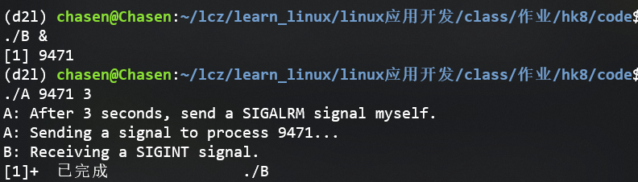
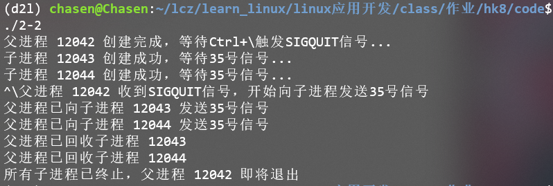
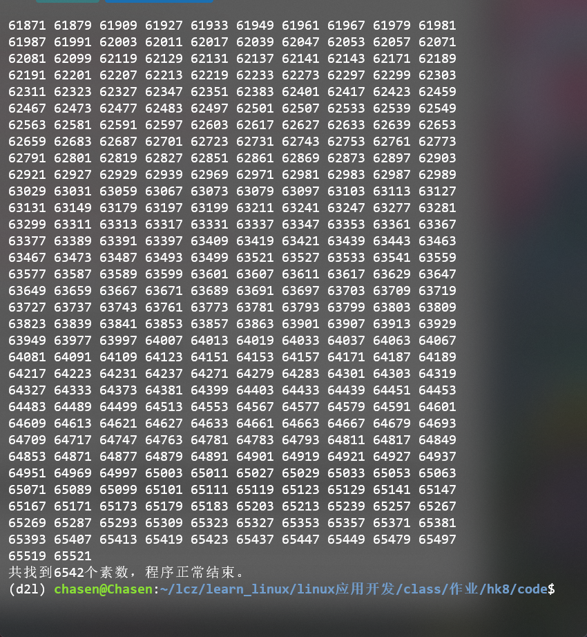
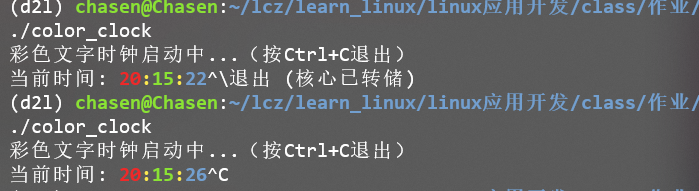

## 1. 问答题

### 1.1. 简述什么是可靠信息和不可靠信息，并试验验证SIGINT是可靠还是不可靠信息。

#### 答案：
信号的 “可靠” 与 “不可靠” 主要针对信号的传递和处理机制：可靠信号（实时信号）支持信号排队，即多次发送同一信号时，内核会记录信号次数并确保所有信号都被进程处理，不会丢失；不可靠信号（传统 UNIX 信号，非实时信号）不支持排队，若进程在处理某一信号时再次收到该信号，后续信号可能被内核丢弃，导致丢失。
要验证 SIGINT（中断信号，通常由 Ctrl+C 触发，编号 2）的可靠性，可通过实验观察：编写一个简单程序，注册 SIGINT 的处理函数，在处理函数中加入延迟（如 sleep 3 秒），确保进程在处理第一个 SIGINT 时处于 “正在处理” 状态；然后运行程序，快速连续按多次 Ctrl+C（即短时间内多次发送 SIGINT）。若程序仅执行一次信号处理函数（即只响应一次），说明后续发送的 SIGINT 被丢弃，证明其不可靠。

## 2. 编程题

### 2.1. 编写程序实现如下功能：

1. 程序A（A.c）按照用户输入的时间参数定时向程序B（B.c）发送信号，B.c程序接收到该信号后，打印输出一条信息并结束，运行示例如下：
1. 先后台运行程序B；再运行A，A有两个参数，第一个是B的进程号（可以从命令ps -uax|grep A获取），第二个是定时时间（秒）。

运行示例：

```
$ ./B &
[9] 8329
$ ./A 8329 3
A: After 3 seconds, send a SIGALRM signal myself.
A: Sending a signal to process 8329...
B: Receiving a SIGINT signal.
```



```c
// A.c

#include <stdio.h>
#include <stdlib.h>
#include <unistd.h>
#include <signal.h>

int main(int argc, char *argv[]) {
    // 检查参数是否正确
    if (argc != 3) {
        fprintf(stderr, "用法: %s <B的进程号> <定时时间(秒)>\n", argv[0]);
        exit(1);
    }
    
    // 解析参数
    pid_t b_pid = atoi(argv[1]);
    int delay_seconds = atoi(argv[2]);
    
    // 等待指定的时间
    sleep(delay_seconds);
    
    // 打印信息
    printf("A: After %d seconds, send a SIGALRM signal myself.\n", delay_seconds);
    printf("A: Sending a signal to process %d...\n", b_pid);
    
    // 向进程B发送SIGINT信号
    if (kill(b_pid, SIGINT) == -1) {
        perror("发送信号失败");
        exit(1);
    }
    
    return 0;
}
```

```c
// B.c

#include <stdio.h>
#include <signal.h>
#include <stdlib.h>

// 信号处理函数
void handle_signal(int signum) {
    if (signum == SIGINT) {
        printf("B: Receiving a SIGINT signal.\n");
        exit(0); // 接收到信号后退出程序
    }
}

int main() {
    // 注册SIGINT信号的处理函数
    if (signal(SIGINT, handle_signal) == SIG_ERR) {
        perror("无法设置信号处理函数");
        exit(1);
    }
    
    // 进入无限循环等待信号
    while (1) {
        pause(); // 暂停程序，等待信号
    }
    
    return 0;
}
```

### 2.2. 编写一个程序，实现以下功能：由父进程创建两个子进程，通过在终端输入“Ctrl+\”组合键向父进程发送SIGQUIT信号；父进程接收到这个信号后，向其两个子进程分别发送整数值为35的信号，子进程获得对应的信号后，终止运行；父进程调用wait函数等待两个子进程都终止后，再自我终止。



```c
// 2.2 


#include <stdio.h>
#include <stdlib.h>
#include <unistd.h>
#include <signal.h>
#include <sys/wait.h>

// 全局变量保存两个子进程的PID
pid_t child_pids[2];

// 父进程处理SIGQUIT信号的函数
void parent_quit_handler(int signo) {
    if (signo == SIGQUIT) {
        printf("父进程 %d 收到SIGQUIT信号，开始向子进程发送35号信号\n", getpid());
        // 向两个子进程分别发送35号信号
        for (int i = 0; i < 2; i++) {
            if (kill(child_pids[i], 35) == -1) {
                perror("发送35号信号失败");
            } else {
                printf("父进程已向子进程 %d 发送35号信号\n", child_pids[i]);
            }
        }
    }
}

// 子进程处理35号信号的函数
void child_signal_handler(int signo) {
    if (signo == 35) {
        printf("子进程 %d 收到35号信号，即将终止\n", getpid());
        exit(0); // 子进程终止
    }
}

int main(int argc, char argv[]) {
    // 创建两个子进程
    for (int i = 0; i < 2; i++) {
        pid_t pid = fork(); // 创建两个子进程
        if (pid == -1) {
            perror("创建子进程失败");
            exit(1);
        } else if (pid == 0) { // 子进程逻辑
            // 子进程注册35号信号的处理函数
            if (signal(35, child_signal_handler) == SIG_ERR) {
                perror("子进程注册信号处理函数失败");
                exit(1);
            }
            printf("子进程 %d 创建成功，等待35号信号...\n", getpid());
            // 子进程进入无限等待（等待信号）
            while (1) {
                pause(); // 暂停进程，直到收到信号
            }
        } else { // 父进程逻辑
            child_pids[i] = pid; // 保存子进程PID
        }
    }

    // 父进程注册SIGQUIT信号的处理函数（对应Ctrl+\）
    if (signal(SIGQUIT, parent_quit_handler) == SIG_ERR) {
        perror("父进程注册信号处理函数失败");
        exit(1);
    }

    printf("父进程 %d 创建完成，等待Ctrl+\\触发SIGQUIT信号...\n", getpid());

    // 父进程等待两个子进程终止
    for (int i = 0; i < 2; i++) {
        wait(NULL); // 等待子进程结束
        printf("父进程已回收子进程 %d\n", child_pids[i]);
    }

    printf("所有子进程已终止，父进程 %d 即将退出\n", getpid());
    return 0;
}
```

### 2.3. 编写一个程序，实现以下功能：

1. 搜索2～65535之间所有的素数并将其保存到数组中；
1. 用户输入ctrl+c发出信号，程序打印出最近找到的素数，并继续搜索；
1. 用户输入ctrl+\发出信号，程序退出运行，并打印出所有已找到的素数；
1. 如没有发出信号，程序打印所有找到素数。



```c
#include <stdio.h>
#include <stdlib.h>
#include <signal.h>
#include <math.h>
#include <stdbool.h>

// 全局变量存储素数相关信息（volatile确保信号处理函数能获取最新值）
volatile int primes[10000];  // 存储找到的素数（足够容纳2~65535所有素数）
volatile int prime_count = 0;  // 已找到的素数数量
volatile int last_prime = 0;   // 最近找到的素数

// 处理Ctrl+C（SIGINT）信号：打印最近找到的素数并继续搜索
void handle_sigint(int signo) {
    if (signo == SIGINT) {
        printf("\n[收到Ctrl+C] 最近找到的素数: %d\n", last_prime);
        // 重新注册信号处理函数（部分系统会重置信号处理方式）
        signal(SIGINT, handle_sigint);
    }
}

// 处理Ctrl+\（SIGQUIT）信号：打印所有已找到的素数并退出
void handle_sigquit(int signo) {
    if (signo == SIGQUIT) {
        printf("\n[收到Ctrl+\\] 所有已找到的素数如下：\n");
        for (int i = 0; i < prime_count; i++) {
            printf("%d ", primes[i]);
            if ((i + 1) % 10 == 0)  // 每行打印10个素数，避免输出混乱
                printf("\n");
        }
        printf("\n共找到%d个素数，程序退出。\n", prime_count);
        exit(0);  // 退出程序
    }
}

// 判断一个数是否为素数
bool is_prime(int n) {
    if (n <= 1) return false;
    if (n == 2) return true;  // 2是唯一偶数素数
    if (n % 2 == 0) return false;  // 偶数排除
    // 检查3到sqrt(n)的奇数是否能整除n
    for (int i = 3; i <= sqrt(n); i += 2) {
        if (n % i == 0)
            return false;
    }
    return true;
}

int main() {
    // 注册信号处理函数
    if (signal(SIGINT, handle_sigint) == SIG_ERR) { // signal函数的作用是如果收到SIGINT的话就只想handle_sigint这个函数
        perror("无法注册SIGINT信号处理函数");
        exit(1);
    }
    if (signal(SIGQUIT, handle_sigquit) == SIG_ERR) {
        perror("无法注册SIGQUIT信号处理函数");
        exit(1);
    }

    printf("开始搜索2~65535之间的素数...\n");
    printf("提示：按Ctrl+C打印最近找到的素数；按Ctrl+\\退出并打印所有素数\n");

    // 搜索2~65535之间的素数
    for (int num = 2; num <= 65535; num++) {
        if (is_prime(num)) {
            primes[prime_count] = num;
            last_prime = num;
            prime_count++;
        }
    }

    // 若未收到退出信号，搜索完成后打印所有素数
    printf("\n[搜索完成] 2~65535之间的所有素数如下：\n");
    for (int i = 0; i < prime_count; i++) {
        printf("%d ", primes[i]);
        if ((i + 1) % 10 == 0)
            printf("\n");
    }
    printf("\n共找到%d个素数，程序正常结束。\n", prime_count);

    return 0;
}
```

### 2.4. 利用alarm函数（也可以利用setitimer函数）编写文字时钟程序，实现数字时钟功能。printf输出利用\033格式化输出彩色文字时钟，格式自拟。



```c
// gcc 2-4.c -o color_clock

#include <stdio.h>
#include <time.h> 
#include <signal.h>
#include <unistd.h> // alarm

// 信号处理函数：每秒更新并打印时钟
void update_clock(int signo) {
    time_t now;
    struct tm *local_time;

    // 获取当前时间
    time(&now);
    local_time = localtime(&now);  // 转换为本地时间

    // ANSI转义序列：清除当前行并将光标移至行首（避免多行输出）
    printf("\033[K");       // 清除从光标到行尾的内容
    printf("\033[0G");      // 将光标移至当前行首

    // 彩色输出时钟（格式：HH:MM:SS）
    // 颜色代码：31(红)、32(绿)、34(蓝)、33(黄)，0m重置颜色
    printf("当前时间: "
           "\033[1;31m%02d\033[0m"   // 小时（红色加粗）
           "\033[1;33m:\033[0m"      // 冒号（黄色加粗）
           "\033[1;32m%02d\033[0m"   // 分钟（绿色加粗）
           "\033[1;33m:\033[0m"      // 冒号（黄色加粗）
           "\033[1;34m%02d\033[0m",  // 秒（蓝色加粗）
           local_time->tm_hour,
           local_time->tm_min,
           local_time->tm_sec);

    fflush(stdout);  // 刷新输出缓冲区（无换行时需手动刷新）
    alarm(1);        // 重新设置1秒后触发下一次信号
    // alarm 函数功能是让内核在指定时间（秒数）后向当前进程发送一个 SIGALRM 信号，从而实现 “定时触发” 的效果
}

int main() {
    // 注册SIGALRM信号的处理函数
    if (signal(SIGALRM, update_clock) == SIG_ERR) {
        perror("无法注册信号处理函数");
        return 1;
    }

    printf("彩色文字时钟启动中...（按Ctrl+C退出）\n");
    alarm(1);  // 启动第一个1秒定时器

    // 主循环：阻塞等待信号（不占用CPU）
    while (1) {
        pause();  // 暂停进程，直到收到信号
    }

    return 0;
}
```
